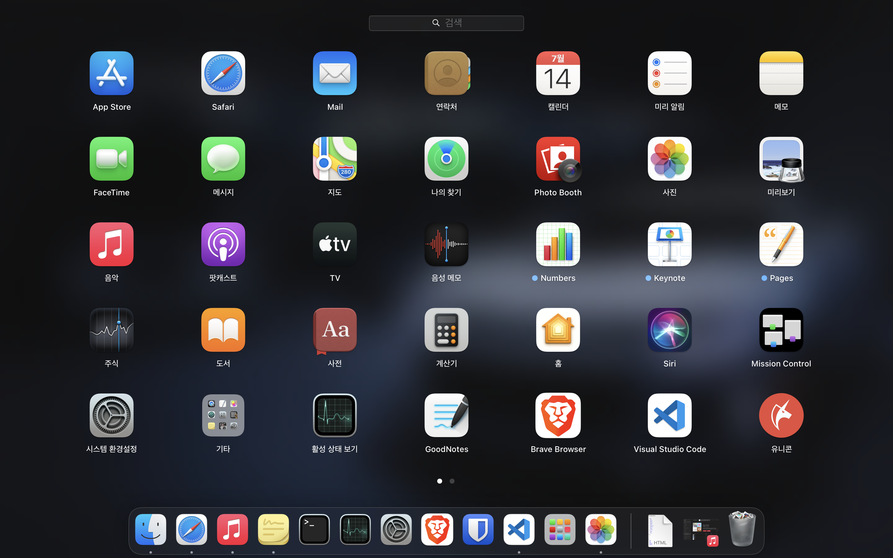
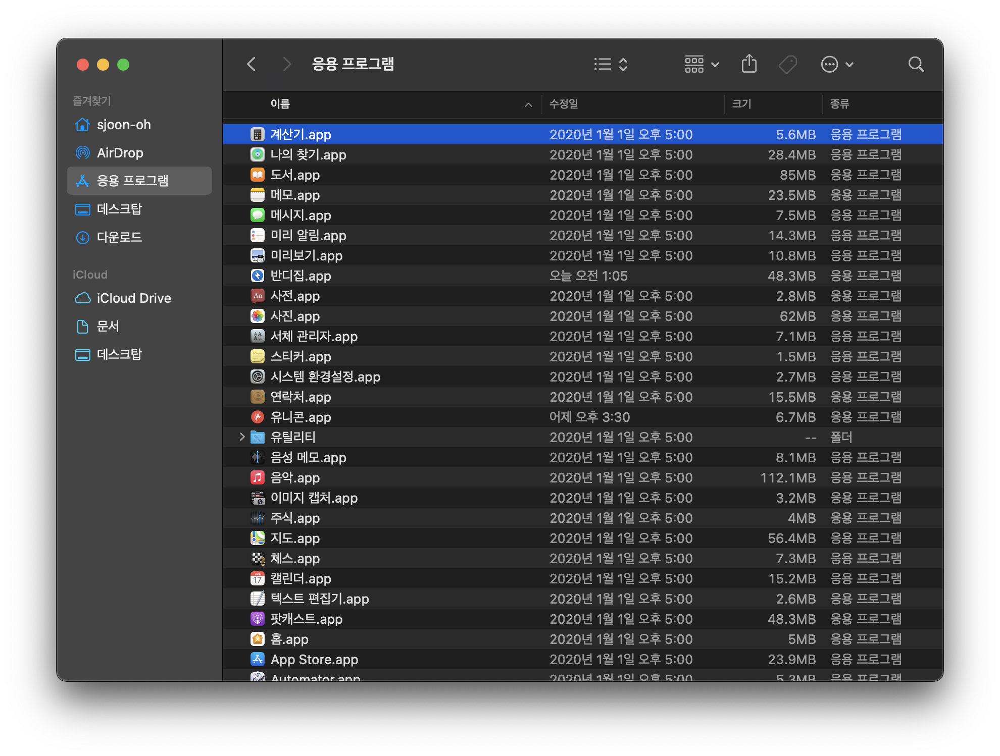

# Hello Mac!

> 이 포스트는 맥북에 대한 간단한 개인적인 첫인상에 대한 글입니다.

가지고 있던 노트북이 오래되어 어딘가 나사가 빠지기 시작했습니다. 대학교 1학년 입학 시기에 샀던 삼성 NT500R5S-YD5S라는 모델이었는데, 배터리 열화는 오래 전부터 문제였고 어느 순간부터 키보드도 말을 안듣기 시작해 센터에 수리 견적을 뽑아보았습니다. 키보드 교체에 값은 대략 10만원 초반, 배터리 교체에 공임비까지 대략 8만원 근처였던 것으로 기억합니다. 저전력 CPU 달고 나온 친구인데 지금 중고로 팔아봤자 20만원도 안할 놈에 20만원 정도를 쓰자니 너무 돈이 아깝고, 해서 KeyTweak으로 문제가 되는 키만 죽여놓고 2만원짜리 무선 키보드를 달아 한동안 사용했습니다. 어차피 자취방에 붙박이로 사용하려던 놈이라 뒷판 까서 배터리도 분리해두고 전원만 직접 연결하여 잘 사용했습니다.

<!--more-->

당시에는 나쁘지 않은 스펙이었습니다. i5-5200U에 8G 메모리, 도중에 맘에 안들어 업그레이드 해주었던 256G SATA SSD, NVIDIA 940m, 15.6인치 디스플레이. 얼마 전까지만 해도 아주 만족스럽게 썼던 친구였습니다. 남들은 더 좋고 빵빵한 스펙으로 Xilinx Viviado Bitstream 생성하는 것도 오래 걸린다고 징징거리던데 별 탈 없이 해주었고, 다른 툴들도 에러 없이 잘 돌아갔구요. 게임은 많이 안했지만 나름 그래픽도 달고나와서 CUDA도 한번 써 보았네요. 단 한가지 가장 큰 불만이었던 점은 이 놈이 1.9kg라는 것입니다. 1학년때는 무슨 생각이었는지 하드를 추가로 달아둬서 더 무겁게 만들고 각종 전공책도 구겨넣고... 그렇게 학교를 다녔던 기억이 납니다. 지금 생각해보면 거의 군장 메고 다녔었네요.

그리고 한동안 동생이 쓰던 HP 노트북이 무슨 문제가 있다고 해서 그걸 받아다 임시로 두 개를 사용중이었습니다. 이 놈은 CPU는 i5 8세대라 나름 괜찮은데 메모리가 4G이라... 그래서 윈도우 밀어버리고 개발용으로 아치 리눅스를 깔아다 사용중이었는데 생각보다 리눅스도 사용성이 좋아서 다음 노트북은 그냥 작고 가벼운 리눅스 노트북으로 사야자 벼르고 있었습니다. 그런데 얼마 전 붙박이 친구가 트랙패드까지 말썽을 일으켜서 새로운 노트북을 알아보게 되었습니다.

## 내가 원하는 조건

어차피 성능을 요구하는 작업은 어떤 노트북을 가지고 와도 불가능합니다. 대부분은 저전력 코어를 달고 있으니까요. 제가 원했던 노트북 최소 스펙은 다음과 같았습니다.

1. 저반사 패널 디스플레이, 14 inch 이하의 크기
2. 1.4kg 이하의 무게
3. 16G 메모리
4. 내장 그래픽, i5/R5 이상
5. 프리도스

반사율이 높으면 화면을 보는게 힘들기 때문에 저반사 패널로, 너무 크고 무거우면 들고 다니기 싫어지니 작고 가볍게, 메모리는 그래도 16G 이상에 적당한 CPU 성능이면 괜찮았습니다. 어차피 자료는 클라우드에 저장해두니 128G SSD여도 상관 없고 리눅스 깔아서 쓸거라 외장 그래픽이 있으면 귀찮아집니다.

저 조건을 만족하면서 적당한 가격은 최근 인기가 많다는 ASUS Zenbook UX425시리즈, ASUS Expertbook B9 정도가 있었습니다. 가격은 한 120만원에서 150만원 정도가 되었습니다. 

그런데 저 정도의 금액으로 올라가니... 맥북이 눈에 들어오기 시작했습니다. 어차피 같은 리눅스(정확히는 유닉스) 계열, 사용성은 리눅스보다는 좋고, 가벼우면서 성능은 준수하고 말이죠. 조금 머뭇거리게 하는 점이라면 Mac을 사용해보지 않았다는 점과 M1의 호환성, 반사 패널, 그리고 램 16G 옵션 추가에 27만원을 더 가져간다는 점 정도가 되겠네요. ASUS와 맥북 중 오랜 고민 끝에 결국에는 M1 맥북 에어 16G 512G 옵션으로 데리고 왔습니다. MacOS를 한번 써 보고 싶기도 했고 다들 맥북은 큰 고장 없이 오래 쓰는 것 같아 천년 만년 쓸 생각으로 말이죠. 

오히려 iCloud를 활성화시키니, 리눅스에서 제 Home 디렉토리에 자주 만들어두던 Document 폴더가 Finder에서 iCloud 쪽으로 링킹이 되어버리는건지, 콘솔에서는 정상적으로 뜨지만 Finder에서는 뜨지 않습니다. 그래서 항상 문서 폴더를 찾는데 헷갈리는 중입니다. 

## 첫 인상: 어렵다

아무래도 Mac은 제가 사용했던 리눅스 환경과 비교가 됩니다. 그리고 굉장히 어렵습니다.

MacOS의 첫 인상은 KDE 환경과 굉장히 닮아있다 라는 것입니다. 정확하게는 KDE와 GNOME 환경을 적절히 섞어 놓은듯한 데스크탑 환경 같습니다. LaunchPad는 GNOME 메뉴와 비슷하고, 애니메이션 효과는 KDE에서 지원하는 것들도 보이구요. Dock은 LatteDock과 비슷하고 메인 설정메뉴는 KDE 쪽이 조금 더 직관적입니다. 

리눅스 데스크탑 환경과의 차이점이라면 MacOS에서는 직관적으로 사용할 수 있다는 것, 특히 트랙패드를 이용한 사용성에서 우월한 것 같습니다. KDE에서 관리하는 다중 Desktop 환경도 트랙패드로 손쉽게 이동이 가능하고 단축키만 좀 적응한다면 쉽게 사용할 수 있을 것 같습니다.

이미지 출처: https://docs.fedoraproject.org//en-US/Fedora/21/html/System_Administrators_Guide/images/menu_GNOME.png

한가지 아직까지 적응이 되지 않는 점은 디렉토리 구조입니다. 직관적인 리눅스와는 다르게 어딘가 달라 무언가를 찾는게 조금 어렵습니다. 예를 들면 iCloud를 활성화시키니, 리눅스에서 제 Home 디렉토리에 자주 만들어두던 Document 폴더가 Finder에서 iCloud 쪽으로 링킹이 되어버리는건지, 콘솔에서는 정상적으로 뜨지만 Finder에서는 뜨지 않습니다. 그래서 항상 문서 폴더를 찾는데 헷갈리는 중입니다. 또 어플리케이션 설치와 삭제가 독특해서 적응하는데 시간이 걸릴 것 같습니다.

## 사과 농장? 글쎄...

저는 아이폰, 아이패드를 사용하고 있습니다. 아, 에어팟도 있네요. 다른 리뷰들을 보면 애플 기기들을 사용하고 있으면 연동성이 좋아 사용하기 좋다고 많이들 이야기를 합니다. 그런데 애초에 저는 애플 기기간 에어 드랍도 사용하고 있지 않고, 아이클라우드는 아이폰과 아이패드 백업 용도로만 사용하고 있어 사실 기기간 데이터 연동은 사진과 애플 뮤직밖에 없습니다. 애초에 중요한 데이터 백업은 pCloud를 이용중이기 때문에 오히려 데이터 연동은 윈도우/리눅스 쪽이 더 편합니다. 

화면이 작은 휴대폰으로 문서를 볼 일도 없구요, 사진이나 영상 편집과 같은 작업은 저는 하지 않으니 아이패드와의 데이터 연동도 솔직히 잘 모르겠습니다. 아이폰에서 사진을 찍으면 바로 컴퓨터에서 확인하거나 이용할 수 있다는 점 하나는 마음에 듭니다. 그렇지만 기타 관련된 iMessage, FaceTime은 사용을 안해서 저는 잘 모르겠습니다. 그런거 없어도 잘만 썼거든요.

## 앞으로

맥북이 M1을 달고 나오면서 아이폰이나 아이패드의 어플리케이션을 실행할 수는 있다고 하는데 이건 조금 더 지켜보아야 할 것 같습니다. 

어쨌든, 처음으로 맥북을 사용해보려 합니다. 리눅스에 비해 얼마나 좋을지, 조금 더 써 보아야 알 것 같습니다. 그나마 우려했던 M1과의 호환성은 개선되고 있는 것 같아 다행입니다. (GCC는 어디?) 그래도 아직까지는 저는 리눅스에 한 표...

