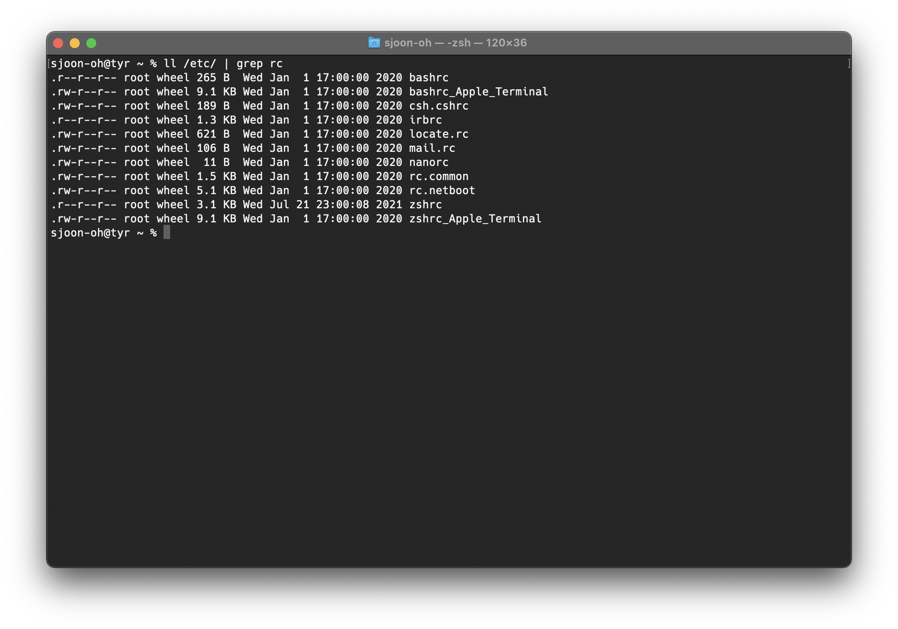

# 맥 zsh

리눅스를 세팅할 때 꼭 먼저 하는 것은 터미널을 제 입맛에 맞게 바꾸는 것입니다. macOS는 윈도우와는 다르게 UNIX 기반이라 리눅스와 호환되는 명령어가 많고 무엇보다 쉘(Shell)을 쓰기가 쉽습니다. 때문에 리눅스에서 작성한 스크립트를 바꾸지 않고 그대로 사용할 수가 있습니다. 맥을 처음 쓰면서 이게 가장 편리하더라구요. 

<!--more-->

제 아치 리눅스에는 fish가 기본 터미널로 잡혀 있습니다. 명령어 자동완성 기능과 브라우저를 이용한 설정을 지원하여 재미있게 사용중에 있습니다. bash와 호환되는 스크립트 문법을 사용하지 않는다는 점 하나를 제외하고는 가장 좋아하는 쉘입니다. 반면 맥에서는 zsh가 디폴트 쉘입니다. 조금 찾아보니 bash에서는 지원하지 않는 auto-complete 기능이나, oh-my-zsh를 통해 다양한 플러그인을 지원하는 등 인기가 많은 쉘인 것 같습니다. 그래서 이번 기회에 zsh도 한번 사용해보려 합니다.

## lsd

리눅스, 맥, 윈도우 어떠한 운영체제를 사용하든 터미널에서 가장 많이 사용하는 명렁어는 아마도 ls가 아닐까 싶습니다. 리눅스 명령어를 배울 때 가장 먼저 배우는 명령어입니다. 디렉토리 구조를 보여줍니다.

```sh
$ ls
```


여기에 -l 옵션을 붙이면 여러가지 정보도 보여줍니다. 권한이나 파일의 종류, 크기 등을 볼 수가 있죠. 


그런데 아무래도 텍스트만으로 이루어진 콘솔창에서 디렉토리 구조와 파일을 구분하거나 파악하는 것은 조금 힘듭니다. 저도 가끔씩 헷갈리더라구요. 그래서 조금 더 사용성을 늘린 ls(deluxe)라는 놈이 있습니다.

[여기](https://github.com/Peltoche/lsd)에서 오픈소스 프로젝트를 확인할 수 있습니다.

lsd를 설치하면 ls와 같이 사용하면 됩니다. 예를 들어, 

```sh
$ lsd
```


앞에 귀염귀염한 확장자 파일 아이콘과 폴더 아이콘이 나타납니다! 또는 이렇게 사용할 수도 있습니다.

```sh
$ lsd --tree
```


파일의 트리 구조를 한눈에 파악하기 쉽게 보여줍니다. 

### 설치하기

아치 리눅스에서는 pacman에서 설치하면 되고, 맥에서는 brew로 설치하면 됩니다.

```sh
$ brew install lsd
```

그러면 /opt/homebrew/bin/lsd 경로에 lsd가 설치되게 됩니다. (M1 맥 기준입니다. 인텔 맥 brew 경로는 다른 것 같더라구요.)

### zsh 설정

아무래도 ls 보다는 lsd를 더 사용하게 될 것 같아 ls만 타이핑을 해도 lsd가 실행되도록 하고 싶습니다. 이건 쉘 설정 파일에서 alias로 지정해주면 되겠지요. 그런데 일반적으로 리눅스 상 bash 설정 파일이 ~/.bashrc에 위치해있는 것과는 달리 맥 zsh 설정파일은 조금 다른 위치에 있더라구요. 



/etc/ 폴더 아래에 각종 쉘 설정파일이 위치해 있습니다. 여기에서 zshrc 파일을 열어 맨 아래 아래와 같이 작성해줍니다.

```sh
alias l='lsd -l'
alias la='lsd -a'
alias ll='lsd -l'
alias lla='lsd -la'
alias lt='lsd --tree'
```

그러면 이제 ls만 쳐도 lsd가 실행됩니다.

### 폰트 설정

위의 설정까지만으로는 lsd가 정상적으로 동작하지 않습니다. lsd는 Nerd 폰트 시리즈가 필요합니다. 아마 각종 아이콘 때문에 필요한 것 같습니다. Nerd 시리즈는 종류가 엄청 많아 저는 무난한 Nerd Hack 폰트로 사용하겠습니다.

폰트는 공개되어 있으며 이 [링크](https://www.nerdfonts.com/font-downloads)에서 설치할 수 있습니다.

맥에서는 다음과 같은 명령어를 통해 설치합니다.

```sh
$ brew tap homebrew/cask-fonts &&
brew install --cask font-<FONT NAME>-nerd-font
```