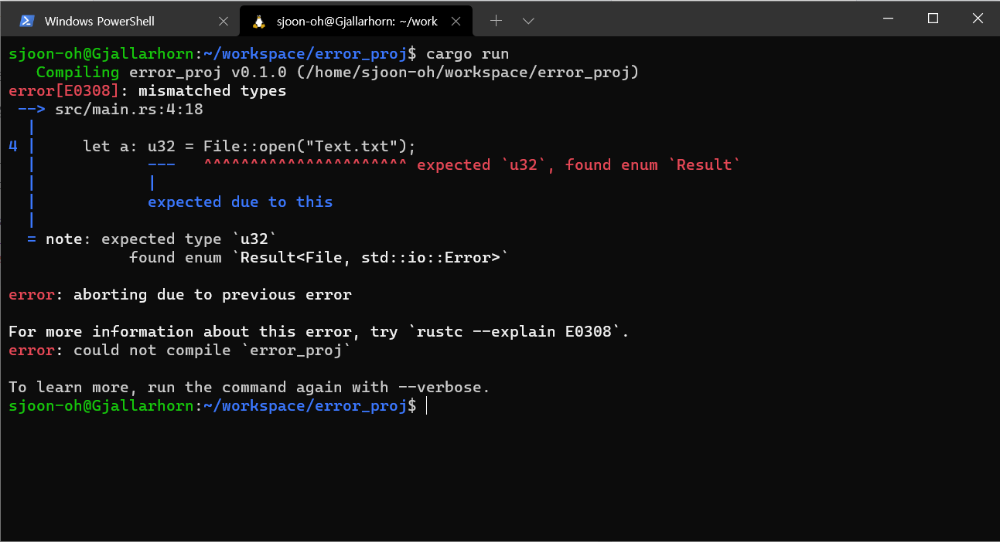

# 에러 처리 (Error Handling)
 
*이 포스트는 Rust를 처음 공부하면서 정리한 내용입니다. 해당 포스트는 개인적으로 기억하기 위한 메모 성격에 가깝습니다. "러스트 프로그래밍 공식 가이드 (2018, 제이펍)" 서적을 참고하였으며, 러스트 공식 [사이트](https://doc.rust-lang.org/1.30.0/book/2018-edition/foreword.html) 에서 책과 동일한 내용을 찾을 수 있습니다. 따라서 더 자세한 내용을 찾으시면 위의 링크를 참고하시면 좋습니다.*

다른 프로그래밍 언어에서는 에러 처리라는 용어 보다는 예외(exception) 처리라는 용어를 더 많이 사용합니다. 예외라는 매커니즘을 통해 프로그램의 오류를 방지하도록 합니다. C++의 `std::exception` 또는 파이썬의 Exception은 흔히 볼 수 있는 예외 처리 메커니즘입니다. 그러나 **Rust에서는 예외라는 개념은 존재하지 않습니다.** 대신 에러를 아래와 같이 두 가지로 표현하고 있습니다.

<!--more-->

- 회복 가능한 에러: `Result<T, E>` 타입
- 회복 불가능한 에러: `panic!` 매크로를 통해 프로그램을 종료

Rust에서는 에러를 두 가지로 나눕니다. 크게 회복 가능한(recoverable) 에러와 회복 불가능한(unrecoverable) 에러의 개념이 있습니다. 회복 가능한 에러는 존재하지 않는 파일 등의 예시가 될 수 있습니다. 즉, 사용자에게 문제를 보고하고 작업을 다시 시작하도록 요청할 수 있습니다. 

반면, 회북 불가능한 에러의 경우 항상 버그의 가능성을 갖고 있는데, 존재하지 않은 배열의 인덱스에 접근하는 것이 대표적인 예시 입니다.


## 회복 불가능한 에러: panic!

우선 회복 불가능한 에러가 발생했을 때 프로그램을 종료시키는 `panic!` 매크로 부터 살펴보겠습니다.

```rust
fn main() {
    println!("Hello, world!");

    // 패닉 매크로
    panic!("Panic!");
}
```


그려면 위와 같이 마지막 두 줄에서 에러 메세지가 출력되는 것을 볼 수 있습니다.

### panic! 역추적 사용하기

C++ 혹은 다른 프로그래밍 언어를 사용하다 보면 내가 발생시킨 오류가 아닌 다른 메세지를 띄워 주는 경우가 많습니다. 표준 라이브러리를 사용하다가 흔히 볼 수 있지요. Rust에서도 다른 곳에서 호출되는 에러 메세지를 만날 수 있습니다.

아래는 기본적인 버퍼 오버리드(Buffer Overread)의 예제입니다. 당연하게도 세 개의 값만 저장되어 있는 벡터에서 100번째 인덱스를 읽으려고 하니 오류가 발생 할 겁니다. 

```rust
fn main() {
    let vector = vec![1, 2, 3];

    let a = vector[99];
}
```

이때 `RUST_BACKTRACE=1`의 환경 변수를 설정해 주고 `cargo run`을 실행하면 아래와 같이 어느 시점에서 에러가 발생했는지 역추적 할 수 있습니다. **이러한 출력 정보를 보기 위해서는 디버그 심볼(debut symbol)이 활성화** 되어 있어야 합니다. **`cargo build`나 `cargo run`에서 아무런 옵션을 주지 않았다면 자동적으로 활성화 되어 있으며, `--release` 옵션을 주면 제외됩니다.**


## 회복 가능한 에러: Result<T, E>

앞서 보았던 `Option<T>`와 같이 `Result<T, E>` 또한 열거자로 정의되어 있습니다. 

```rust
enum Result<T, E> {
    Ok(T),
    Error(E)
}
```

`Result` 또한 `Option과` 같이 `std::prelude`에 의해 자동으로 포함되기 때문에 `Ok`나 `Error` 앞에 `Result::`를 명시할 필요는 없습니다.

T와 E는 제네릭 타입의 매개변수로, 작업이 성공하면 `Ok` 열것값은 T 타입의 내용을 포함할 것이고 작업이 실패하는 경우에는 `Error` 열것값은 E 타입의 내용을 포함하게 될 것임을 추측할 수 있습니다. 

이러한 `Result<T, E>`의 값을 확인하기 위해서는 공식 문서를 확인하거나 직접 컴파일하여 확인해도 됩니다. 예를 들어 파일을 여는 함수인 `File::open` 함수가 `Result` 타입을 리턴하는지 확인하려면 아래와 같은 코드를 돌려보면 됩니다.

```rust
fn main() {
    let a: u32 = File::open("Text.txt");
}
```




코드로는 `u32` 타입을 명시했으나 반환되는 값은 `Result<File, std::io::Error>` 라고 오류를 뿜어대고 있습니다. 여기에서 T의 타입은 `File`, `E`의 타입은 `std::io::Error`가 됨을 확인할 수 있습니다. 이와 함께 파일을 성공적으로 열었다면 `a`는 `Result의` `Ok(File)` 열것값이 될 것이고, 실패한 경우에는 `Error(std::io::Error)`의 열것값을 가질 것입니다.

그렇다면 위의 `Result` 에러는 아래의 `match` 표현식을 사용하여 처리가 가능합니다.

코드로 확인 해 보겠습니다.

```rust
use std::fs::File;

fn main() {
    let file = File::open("Text.txt");

    let file = match file {
        Ok(file) => file,
        Err(error) => {
            panic!("Failed: {:?}", error);
        }
    };
}
```


### match를 이용한 중첩 에러 처리

위의 코드는 하나의 `match` 표현식으로 `File::open` 에서의 에러를 처리하고 있습니다. 그러나 실패 원인에 따라 다르게 동작하도록 아래와 같이 수정이 가능합니다. 이를 처리하기 위해서라면 중첩된 `match` 표현식을 이용하면 됩니다.

```rust
use std::fs::File;
use std::io::ErrorKind;

fn main() {
    let f = File::open("Text.txt");
    let f = match f { // 첫 번째 에러
        Ok(file) => file,
        Err(ref error) => match error.kind() { // 중첩된 에러 처리
            ErrorKind::NotFound => match File::create("Text.txt") {
                Ok(fc) => fc,
                Err(e) => panic!("Could not create file")
            },
            other_error => panic!("Could not open file! {:?}", other_error)
        },
    };
}
```

실행 전의 디렉토리 구조는 아래와 같습니다.


Text.txt 파일이 존재하지 않으므로 File::create 함수를 이용하여 파일을 생성하도록 했습니다. 아래는 실행 결과입니다.


### 더 간단한 방법: unwrap과 expect

위의 예시에서는 `match`를 이용하기 때문에 코드가 길어지는 단점이 있습니다. 따라서 `Result<T, E>` 타입은 다양한 편의 메서드를 제공하는데 그 중에 소개할 것들이 `unwrap`과 `expect` 입니다. `unwrap`과 `expect`는 위에서 작성한 `match` 구문과 정확히 같은 동작을 합니다.

- `unwrap()` : `Result<T, E>`의 반환값이 `Ok(T)` 라면 `Ok` 열것값에 저장된 값을 리턴하며, `Err(E)`라면 `panic!` 매크로를 호출합니다. 그러나 사용자 에러 메세지는 보여주지 않습니다.
- `expect()` : 동작은 `unwrap`과 같으나 사용자 에러 메세지를 포함합니다.

```rust
use std::fs::File;

fn main() {
    let f = File::open("Text.txt").unwrap();
}
```


```rust
use std::fs::File;

fn main() {
    let f = File::open("Text.txt").expect("User's error msg!");
}
```


### Error 전파 (Propagating Errors): 명시적 return

에러가 발생했을 때 함수 내에서 처리해도 되지만 호출부로 책임을 떠넘길 수 있습니다. 

```rust
use std::fs::File;
use std::io;
use std::io::Read;

fn read_username_from_file() -> Result<String, io::Error> {
    let f = File::open("hello.txt");

    let mut f = match f {
        Ok(file) => file,
        Err(e) => return Err(e), // 여기서 명시적 Err(e) 리턴!!
    };

    let mut s = String::new();

    match f.read_to_string(&mut s) {
        Ok(_) => Ok(s),
        Err(e) => Err(e),
    } // 마지막은 표현식!! (리턴)
}
```

함수 `read_username_from_file`은 `Result<String, io::Error>` 타입을 리턴하고 있습니다. 이러한 패턴은 흔하기 때문에 Rust에서는 `?` 연산자를 제공하여 더 쉽게 처리하도록 도와줍니다.


### Error 전파 (Propagating Errors): ? 연산자

위의 코드를 `?` 연산자를 이용하여 재작성하면 아래와 같이 됩니다.

```rust
use std::fs::File;
use std::io;
use std::io::Read;

fn read_username_from_file() -> Result<String, io::Error> {
    let mut f = File::open("hello.txt")?; // 여기서 Result 타입 처리
    let mut s = String::new();
    f.read_to_string(&mut s)?; // 여기서 Result 타입 처리
    Ok(s)
}
```

또는 아래와 같이 연속적으로 작성할 수도 있습니다.

```rust
use std::fs::File;
use std::io;
use std::io::Read;

fn read_username_from_file() -> Result<String, io::Error> {
    let mut s = String::new();

    File::open("hello.txt")?.read_to_string(&mut s)?;
    // 연속적으로 두 번 에러 검사

    Ok(s)
}
```

`Result` 뒤의 `?` 연산자는 위에서의 `match` 표현식과 거의 동일한 방식으로 동작합니다. 아래는 `?` 연산자를 사용하는 경우 `match` 표현식과의 차이점을 정리하고 있습니다.

1. **? 연산자는 에러값을 `from` 함수를 이용하여 전달**합니다. 이 함수는 표준 라이브러리에 정의된 `From` 트레이터에 선언되어 있습니다. **`from` 함수가 호출되면 전달된 에러 타입은 현재 함수의 리턴 타입에 정의된 에러 타입으로 변환**됩니다.
2. **? 연산자는 무조건 `Result` 타입을 리턴하는 함수에서만 사용 가능**합니다.


참고로, `main` 함수는 조금 특별한 함수입니다. `main` 함수는 두 가지의 타입을 리턴할 수 있는데, `()` 타입과 `Result<T, E>` 타입입니다. 

```rust
use std::error::Error;
use std::fs::File;

fn main -> Result<(), Box<dyn Error>> {
    let f = File::open("Text.txt");
    Ok(())
}
```

