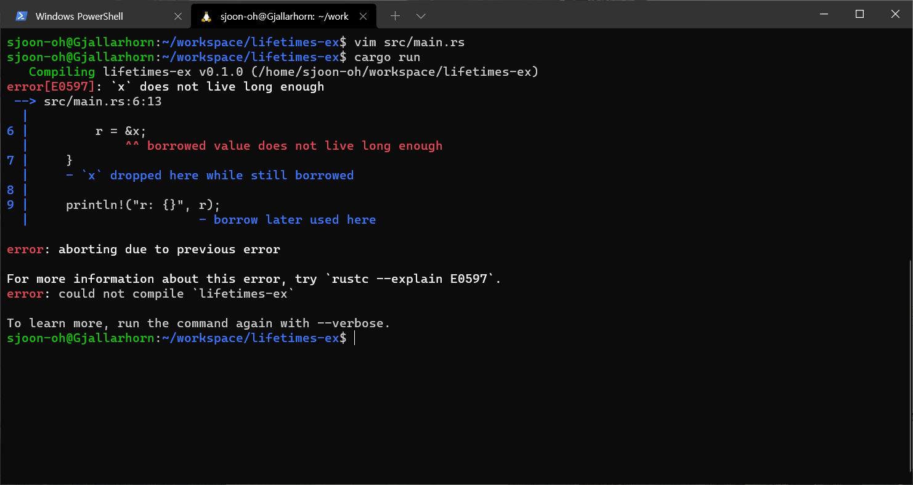

# 참조와 수명
 
*이 포스트는 Rust를 처음 공부하면서 정리한 내용입니다. 해당 포스트는 개인적으로 기억하기 위한 메모 성격에 가깝습니다. "러스트 프로그래밍 공식 가이드 (2018, 제이펍)" 서적을 참고하였으며, 러스트 공식 [사이트](https://doc.rust-lang.org/1.30.0/book/2018-edition/foreword.html) 에서 책과 동일한 내용을 찾을 수 있습니다. 따라서 더 자세한 내용을 찾으시면 위의 링크를 참고하시면 좋습니다.*

Rust 에서 참조의 유효성과 관련된 내용은 C/C++에서 말하는 Dangling Pointer에 관련된 이야기입니다. 죽은 참조와 관련된 내용은 C/C++에서 많이 다루는 이야기이기 때문에 여기까지는 어느 정도 쉽게 이해가 갑니다. 그러나 범위(Scope)를 벗어나면 메모리가 해제되는 Rust 에서도 죽은 참조가 일어날 수 있습니다. 수명(Lifetimes)과 관련된 내용은 이렇게 Rust에서 일어날 수 있는 죽은 참조로부터 시작됩니다.

수명과 관련된 이야기는 Rust를 처음 접할 때 이해가 가장 가지 않는 내용 중 하나였습니다. 이 포스트에서는 [공식 가이드](https://doc.rust-lang.org/1.30.0/book/2018-edition/ch10-03-lifetime-syntax.html) 및 다른 해외 블로그의 예시를 이용하여 제가 이해한 내용을 바탕으로 재구성하였습니다. 

<!--more-->

## 죽은 참조 (Dangling Reference)

다시 한번 Rust 에서 지원하는 참조에 대한 규칙을 짚고 넘어가겠습니다. 

1. 어느 한 시점에 코드는 하나의 가변 참조 또는 여러 개의 불변 참조를 생성할 수는 있지만 둘 모두를 생성할 수는 없다.
2. 참조는 항상 유효해야 한다.

수명과 관련해서 중요하게 기억해야 하는 점은 항상 **참조**와 관련되어 있는 개념이라는 것입니다. 수명의 주요 목적은 2번 규칙에서 이야가 하는 유효(Valid)함, 즉 **죽은 참조가 발행하는 것을 방지하는 것**입니다. 

아래와 같은 코드에서는 죽은 참조가 발생합니다.

```rust
{
    let r;

    { // 새로운 범위
        let x = 5;
        r = &x; // 여기서 x를 대여(Borrow)
    }

    println!("r: {}", r); // 해제된 x에 대한 참조
}
```

위 코드의 실행 결과는 아래와 같습니다. 



`x`는 내부 범위에서만 생존이 가능한데 외부 범위에서 선언된 `r`이 `x`를 대여(Borrowing)하고 있으니 당연히 빌린 변수가 오래오래 장수하지 않는다는 에러 메세지를 보여줍니다. 이는 빌려준 `x`의 수명은 빌려온 `r`의 수명 보다는 길어야 함을 의미합니다. 컴파일러는 이러한 수명을 **대여 검사기**를 통해 판단합니다.


### Borrow Checker (대여 검사기)

Rust 컴파일러는 대여한 값이 현재 범위에서 유효한지 검사하는 대여 검사기(Borrow Checker)를 탑재하고 있습니다. 공식 [문서](https://rustc-dev-guide.rust-lang.org/borrow_check.html#major-phases-of-the-borrow-checker)에서는 더 자세히 나와있는 것 같지만... 저는 컴파일러는 아직 자세하게 모르니 가이드에 나온 내용만 정리하겠습니다.

Rust 에서는 수명을 **수명 애노테이션 문법 (lifetime annotiation syntax)** 을 이용하여 나타냅니다. 이는 작은 따옴표와 소문자로 구성된 이름을 사용합니다. 물론 긴 이름을 사용할 수도 있습니다. 

```rust
&i32 // Reference
&'a i32 // 수명이 'a인 참조
&'a mut i32
&'some_lifetime i32
&'static i32
```

수명 애노테이션 문법을 사용하여 위의 코드에 대한 수명을 표시하면 아래와 같습니다.

```rust
{
    let r;                // ---------+-- 'a
                          //          |
    {                     //          |
        let x = 5;        // -+-- 'b  |
        r = &x;           //  |       |
    }                     // -+       |
                          //          |
    println!("r: {}", r); //          |
}  
```

위의 예제에서는 `r`의 수명이 `'a`, 'x'의 수명을 `'b`로 설정하였습니다. 한 눈에 보이듯, `'a`의 수명이 `'b`보다 긴 것을 볼 수 있습니다. Rust 컴파일러는 이렇게 컴파일 타임에 두 변수의 수명 크기를 비교하여 수명이 간 `r`이 수명이 짧은 `x` 변수의 참조 값을 가지고 있다는 것을 알아냅니다. **참조의 대상의 수명이 참조의 수명 보다 짧으므로 컴파일을 허락하지 않습니다.** 


## 컴파일러의 수명의 생략 규칙 (Lifetime Elision)

Rust의 초기 버전 (pre-1.0) 에서는 모든 참조가 명시적으로 수명이 있어야 했습니다. 그러나 예측 가능한 일반적인 몇 가지의 상황이 있기 때문에 우리는 이제까지 수명을 명시적으로 지정하지 않고 Rust를 사용했었습니다. 또 아마 명시적으로 수명을 지정해야 한다면 코드의 크기가 길어질 것입니다. 따라서 수명을 생략할 수 있는 **생략 규칙**이 있는데 이는 아래와 같습니다. 먼저 이 생략 규칙을 짚고 넘어가겠습니다. 

다시 강조하지만 **수명은 참조와 관련된 이야기**입니다!

* 입력 수명 (Input Lifetimes): 함수 또는 메서드의 매개 변수가 갖는 수명
* 출력 수명 (Output Lifetimes): 반환 값에 적용되는 수명

1. Each parameter that is a reference gets its own lifetime parameter. - 각각의 매개 변수는 각각 독립적인 수명을 갖습니다.
2. If there is exactly one input lifetime parameter, that lifetime is assigned to all output lifetime parameters: `fn foo<'a>(x: &'a i32) -> &'a i32` - 하나의 입력 수명 매개 변수가 존재한다면 그 입력 수명을 모든 출력 수명으로 지정합니다.
3. If there are multiple input lifetime parameters, but one of them is `&self` or `&mut self` because this is a method, the lifetime of self is assigned to all output lifetime parameters. - 매개 변수가 여러 개일 때 그 중 `&self`나 `&mut self`가 존재한다면 `self` 변수의 수명을 모든 출력 수명으로 지정합니다. 

\* Rust 2018 기준이며 추후 버전에서 변동 될 가능성이 존재합니다.

생략 규칙은 1, 2, 3 모두를 순서대로 적용해야 합니다. 적용 후 **모든 입력 수명과 출력 수명을 정상적으로 가지게 되는 경우** 생략할 수 있습니다. 반대로 **컴파일러가 생략 규칙에 의해 수명을 자동 지정할 수 없는 경우 명시적으로 수명을 지정해 주어야 합니다.**


## 수명 생략 규칙 적용하기

가이드에 나와있는 간단한 예시를 보겠습니다.

### 예시 1

```rust
fn first_word(s: &str) -> &str {
```

1번 생략 규칙을 적용하면 아래와 같습니다. 

```rust
fn first_word<'a>(s: &'a str) -> &str {
```

2번 생략 규칙을 적용하면 아래와 같습니다. 

```rust
fn first_word<'a>(s: &'a str) -> &'a str {
```

모든 입출력 수명이 정상적으로 갖게 되었으므로 컴파일러는 오류 없이 이 함수를 컴파일 할 수 있습니다. 


### 예시 2

```rust
fn longest(x: &str, y: &str) -> &str {
    if x.len() > y.len() { x }
    else { y }
}
```

위의 코드는 **컴파일 되지 않습니다!** 이는 위의 규칙을 적용하면 아주 명확해집니다. 

1번 생략 규칙을 적용하면 아래와 같습니다. 

```rust
fn longest<'a, 'b>(x: &'a str, y: &'b str) -> &str {
```

2번 생략 규칙과 3번 생략 규칙의 경우 이 함수에 해당되지 않으므로 적용이 불가능 합니다. 따라서 컴파일러는 함수의 수명 형태는 아래와 같이 판단합니다.

```rust
fn longest<'a, 'b>(x: &'a str, y: &'b str) -> &??? str {
```

음? 리턴 타입의 수명을 판단할 수 없습니다! 이는 직관적으로도 이해가 가능한 부분입니다. 컴파일러나 프로그래머 조차 `longest` 함수의  `if` 문에서 어떤 것이 리턴될 지 모르기 때문에 수명을 지정할 수 없죠. 즉, 어떠한 참조의 수명도 명확하게 알 수 없기 때문에 리턴되는 참조의 수명도 지정할 수 없습니다. 

따라서 **컴파일러가 수명 생략 규칙에 의해 수명을 알 수 없는 경우 수명 애노테이션을 문법을 사용하여 프로그래머가 직접 참조 간의 관계를 정의해야 합니다.** 


## 함수 시그니처

위 예제 2의 함수를 정상적으로 컴파일 하기 위해서는 아래와 같이 수명을 지정해 주면 됩니다. 

```rust
fn longest<'a>(x: &'a str, y: &'a str) -> &'a str {
    if x.len() > y.len() { x }
    else { y }
}
```

## 구조체

수명은 함수 뿐만이 아니라 구조체에도 지정해야 합니다. 이는 **구조체가 멤버로 참조 변수를 가지고 있을 때** 발생합니다. 

```rust
struct ImportantExcerpt<'a> {
    part: &'a str,
}

fn main() {
    let novel = String::from("Some String!");
    let instance = ImportantExcerpt {part: &novel[0::5] };
}
```

위의 `ImportantExcerpt` 구조체는 슬라이스 참조를 멤버로 가지고 있습니다. 그리고 이 구조체는 오로지 데이터를 저장하는 용도로만 사용되고 있습니다. 따라서 구조체에 참조 애노테이션을 지정하여 **구조체의 인스턴스가 `part` 필드에 저장한 참조의 수명을 벗어날 수 없다는 의미**를 부여합니다. 


## 메서드

구조체 메서드 수명 지정 문법은 기본적으로 함수 시그니처에서의 사용법과 동일하며, 생략 규칙또한 동일하게 적용됩니다. 그러나 차이점이라면 `impl` 키워드 다음에 수명 매개변수를 선언 해 주어야 한다는 것입니다. 어렵게 생각하지 말고 제네릭 문법과 동일하게 사용하면 됩니다. 

```rust
impl<'a> ImportantExcerpt<'a> {
    // ... 
}
```

## 정적 수명

정적 수명 `'static` 수명은 전체 프로그램에 적용되는 수명입니다. 문자열 리터럴이  정적 수명의 대표적이 예시 입니다. 정적 수명은 아래와 같이 동일한 방법으로 선언합니다. 

```rust
let some_static_ref: &'static str = "Hello Rust!";
```


## 제네릭과 같이 사용

제네릭과 수명이 동시에 사용되는 경우에는 아래와 같은 형식으로 사용하면 됩니다.

```rust
fn some_function<'a, T>(x: &'a str, y: T) -> &'a str {
    // ...
}
```


