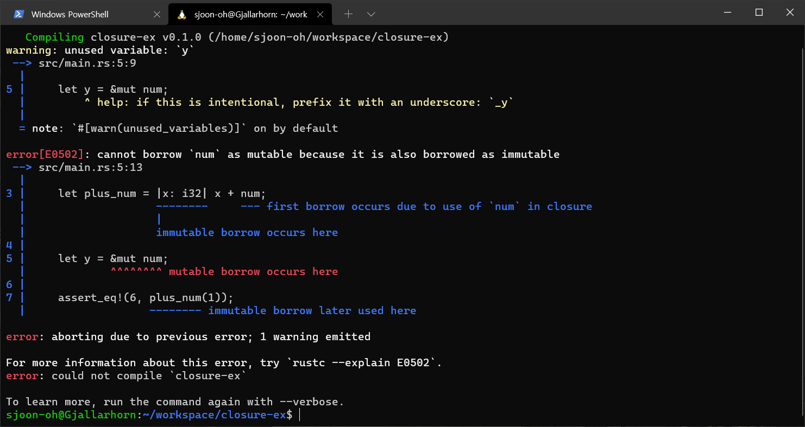
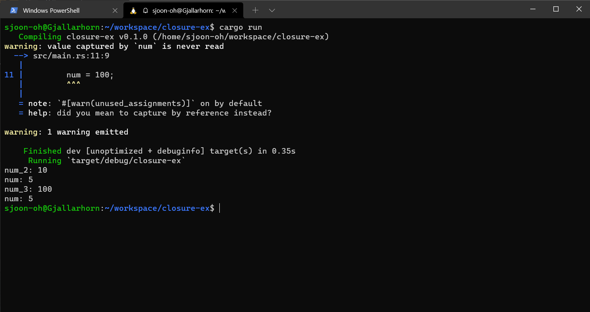

# 클로저 (Closures)
 
*이 포스트는 Rust를 처음 공부하면서 정리한 내용입니다. 해당 포스트는 개인적으로 기억하기 위한 메모 성격에 가깝습니다. "러스트 프로그래밍 공식 가이드 (2018, 제이펍)" 서적을 참고하였으며, 러스트 공식 [사이트](https://doc.rust-lang.org/1.30.0/book/2018-edition/foreword.html) 에서 책과 동일한 내용을 찾을 수 있습니다. 따라서 더 자세한 내용을 찾으시면 위의 링크를 참고하시면 좋습니다.*

클로저(Closures)란 함수형 프로그래밍 패러다임에서 자주 쓰이는 개념입니다. Rust [가이드](https://web.mit.edu/rust-lang_v1.25/arch/amd64_ubuntu1404/share/doc/rust/html/book/first-edition/closures.html#syntax) 에서는 **변수에 저장이 가능한 함수 형식** 이라고 설명하고 있습니다. 함수형 프로그래밍에 관련해서는 아직 잘 모르기 때문에 이와 관련된 개념은 깊게 들어가지 않고 Rust 에서 지원하는 **익명 함수 (Anonymous Functions)**의 사용법에 관련해서만 정리하겠습니다. 

<!--more-->

## 문법 (Syntax)

### C++11 람다 함수

Rust의 클로저는 C++11 부터 지원하는 람다 함수 문법을 생각하시면 됩니다. 잠깐 복습하고 가겠습니다. C++ 에서의 람다 함수는 아래와 같은 형식을 따릅니다.

```cpp
[ captures ] ( params ) trailing_return_type { body }
```

위의 형식을 따르는 간단한 예시입니다.

```cpp
auto glambda = [](auto a, auto&& b) -> bool { return a < b; };
```

`a` 인자와 `b`인자를 가지고 `bool` 타입의 반환값을 리턴하는 함수입니다. 이때 꺾쇠 안에는 캡처(Captures)를 지정하며, 캡처란 **람다 함수 내부에서 외부 변수를 잡는 방식을 명시하는 방법**입니다. 캡처는 크게 두 가지 방식이 있었습니다. 

- `[=]` : 모든 외부 변수를 값으로 전달받아서 캡쳐
- `[&]` : 모든 외부 변수를 참조로 전달받아서 캡쳐


### Rust의 클로저

클로저는 아래와 같은 문법 형식을 따릅니다. 이는 C++의 람다 함수와 비슷한 형태를 띄고 있습니다. **클로저는 일반 함수처럼 매개 변수와 리턴값의 타입을 지정할 필요는 없습니다.** 함수에서 타입을 지정해야 하는 이유는 사용자에게 노출되는 인터페이스이기 때문인데, 클로저는 인터페이스처럼 동작하지 않기 때문입니다. 

C++ 에서 사용되는 람다 함수를 생각해보면 이해가 쉽습니다. 다양한 시나리오를 처리하는 함수와는 다르게 람다 함수는 제한된 범위에서 실행되기 때문입니다. 즉, 실행 문맥이 제한되어 있으므로 컴파일러는 쉽게 매개 변수와 리턴 타입을 추론할 수 있습니다. 단, **익명 함수가 구체화 되는 경우 하나의 타입만을 사용합니다.**

```rust
let sample_closure = |x| x;

let sample_closure(String::from("Hello Rust!"));
let sample_closure(5);
```

위의 예제는 컴파일 되지 않습니다. 

물론, **타입을 지정할 수도 있습니다.** 아래의 예시를 참고합시다.

```rust
let plus_one = |x: i32| x + 1;
let plus_one_2 = |x: i32| -> i32 { x + 1 };

let plus_two = |x| {
    let mut result: i32 = x;

    result += 1;
    result += 1;

    result
};
```

`fn` 키워드로 생성하는 일반적인 함수 형태와 비교하면 아래와 같습니다. 차이점이라면 **인수를 작성하는 괄호 `( )` 대신 파이프 `| |`가 이용**됩니다. 


```rust
fn  plus_one_v1   (x: i32) -> i32 { x + 1 }
let plus_one_v2 = |x: i32| -> i32 { x + 1 };
let plus_one_v3 = |x: i32|          x + 1  ;
let plus_one_v4 = |x|               x + 1 ;
```


## 캡처 (Captures)

Rust 에서 캡처란 익명 함수가 정의된 범위 내의 변수에 접근할 수 있는 기능입니다. 이는 C++에서 사용되는 개념과 동일합니다. 

### 기본 캡쳐: Borrow

**기본적으로 익명 함수는 외부 변수를 대여(Borrow)합니다.** 

```rust
let num = 5;
let plus_num = |x: i32| x + num;
```

그렇다면 아래의 코드는 어떻게 될까요?

```rust
let mut num = 5;
let plus_num = |x: i32| x + num;

let y = &mut num;
```



클로저에서 `num` 변수에 대한 대여가 끝나지 않았기 때문에 `&mut` 형식의 대여가 허용되지 않는다는 에러 메세지를 볼 수 있습니다. 

만일 가변 대여(Mutable Borrow)를 원하는 경우 아래와 같은 클로저를 선언하면 됩니다. 

```rust
let mut plus_num = |x: i32| x + num;
```

### move 클로저

클로저에게 소유권을 부여해야 하는 경우 `move` 키워드를 사용하면 됩니다. `move`는 강제적으로 외부 환경의 변수에 대한 소유권을 이동시킵니다. 

```rust
let num = 5;
let owns_num = move |x: i32| x + num;
```

이때 가이드에서는 아래와 같이 설명하고 있습니다.

> Now, even though the keyword is move, the variables follow normal move semantics.

즉 기본 move 메커니즘을 따른다는 것인데, [소유권과 대여에 대한 이해](https://sjoon-oh.github.io/archivers/rust-4#3-%EB%B3%B5%EC%82%ACcopy) 포스트에서 언급한 내용을 잠깐 다시 가져오겠습니다. 위의 예시에서 `num` 변수는 기본 스칼라 타입입니다. 따라서 `Copy` 트레이트가 적용되어 있기 때문에 소유권이 이동되는 것이 아니라 값이 복사되어 넘어갑니다. 따라서 아래의 코드를 실행시키면 다음의 결과가 나타납니다. 

```rust
fn main() {
    let mut num = 5;
    let plus_num = |x: i32| x + num;

    let num_2 = plus_num(5);

    println!("num_2: {}", num_2);
    println!("num: {}", num);

    let mut owns_num = move || {
        num = 100;
        num
    };


    let num_3 = owns_num();

    println!("num_3: {}", num_3);
    println!("num: {}", num);

}
``` 




위의 `plus_num` 함수는 대여하여 `num` 변수를 가져가고 있고, `owns_num`의 경우는 `move` 키워드를 이용하여 강제로 소유권을 이동시키고 있습니다. 따라서 소유권이 이동하였으므로 기존의 `num` 변수가 100을 가지도록 수정되어야 하지만 `owns_num` 함수가 불렸음에도 불구하고 값이 변하지 않았음을 볼 수 있습니다. 즉, 소유권의 move 가 아니라 **복사된 값의 소유권**을 가지게 되었음을 알 수 있습니다.

클로저는 자신의 주변에서 값을 캠처할 때 본문에서 사용할 값을 메모리에 저장합니다. 따라서 캡처가 없는 클로저보다 캡처가 존재하는 클로저의 경우 오버헤드가 발생할 수 있습니다.


## 클로저 저장하기: Fn, FnOnce, FnMut

위의 간단한 예제에서 클로저는 변수에 할당할 수 있었습니다. 이는 구조체의 필드에 저장하는 경우에도 가능합니다. 그러나 구조체를 선언하는 경우는 미리 필드의 (이 경우 클로저의 타입) 타입을 알고 있어야 합니다. 그리고 **클로저의 인스턴스는 각자 유일한 익명 타입을 가집니다. 따라서 같은 시그니처의 클로저라도 다른 타입으로 인식합니다.** 

클로저를 사용하는 구조체나 열거자, 함수 등을 선언하려면 **제네릭과 트레이트 경계**를 활용해야 합니다.

```rust
struct SomeStruct<T> 
    where T: Fn(u32) -> u32
{
    some_closure: T,
    some_value: i32
}
```

`some_closure` 변수는 `T` 타입을 가지며 트레이트 경계는 `Fn(u32) -> u32` 로 지정되어 있습니다. 이 클로저는 반드시 하나의 `u32` 타입의 매개변수를 가져야 하고, 반드시 `u32` 타입의 리턴 값을 반환해야 합니다.

함수의 인자로 클로저 형태를 지정할 수도 있습니다. 이는 마찬가지로 아래와 같이 작성합니다.

```rust
fn call_with_one<F>(some_closure: F) -> i32
    where F: Fn(i32) -> i32 {

    some_closure(1)
}

let answer = call_with_one(|x| x + 2);

assert_eq!(3, answer);
```


이때 지정한 `Fn`은 트레이트입니다. `Fn`, `FnOnce`, `FnMut` 트레이트는 같은 범위에 선언된 변수(환경, Environment)를 캡처해오는 방식을 지정합니다. 

- `Fn` : Environment의 값을 불변으로 대여합니다. (immutable borrow)
- `FnOnce` : Environment 변수의 소유권을 클로저 안으로 이동시킵니다. Once는 같은 값에 대한 소유권은 오직 한 번만 가진다는 의미입니다.
- `FnMut` : Environment의 값을 가변으로 대여합니다. (mutable borrow)

