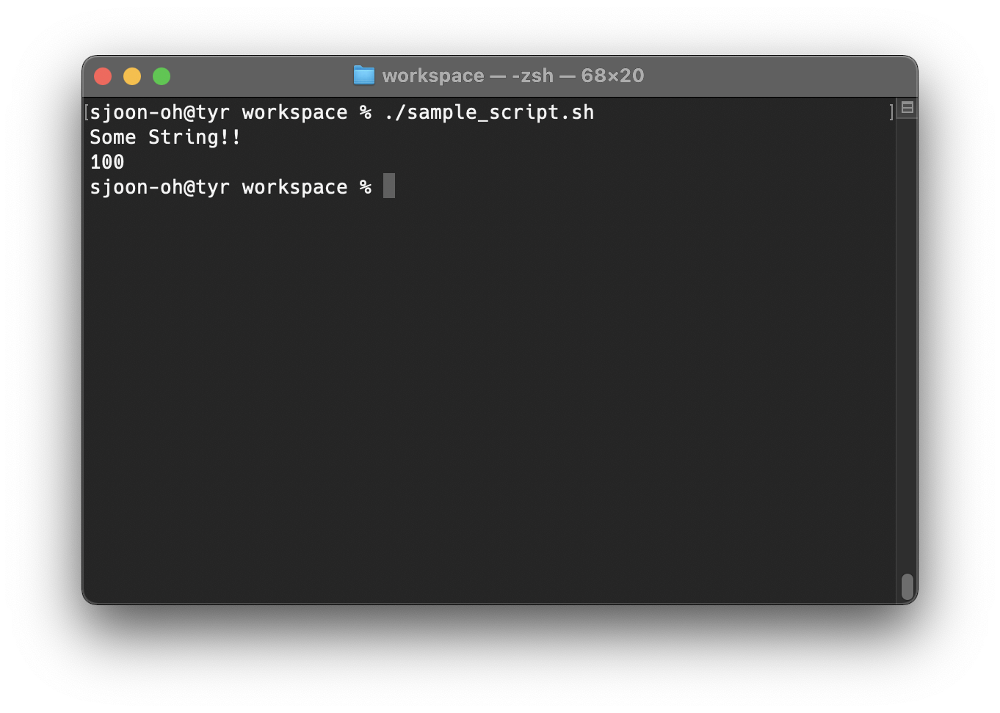
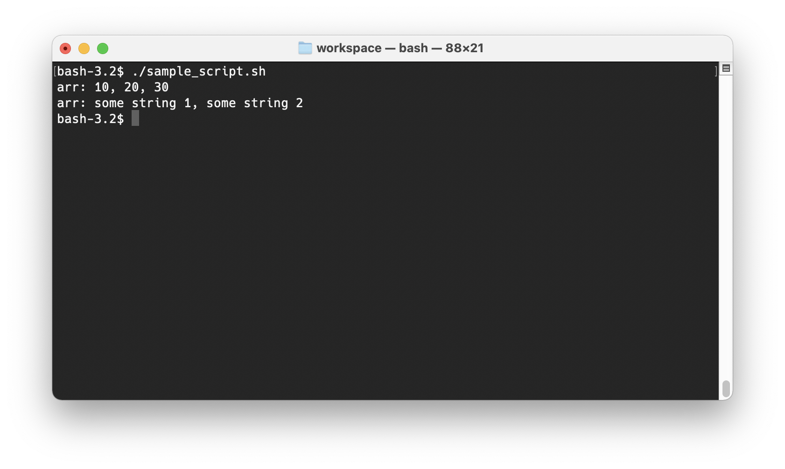
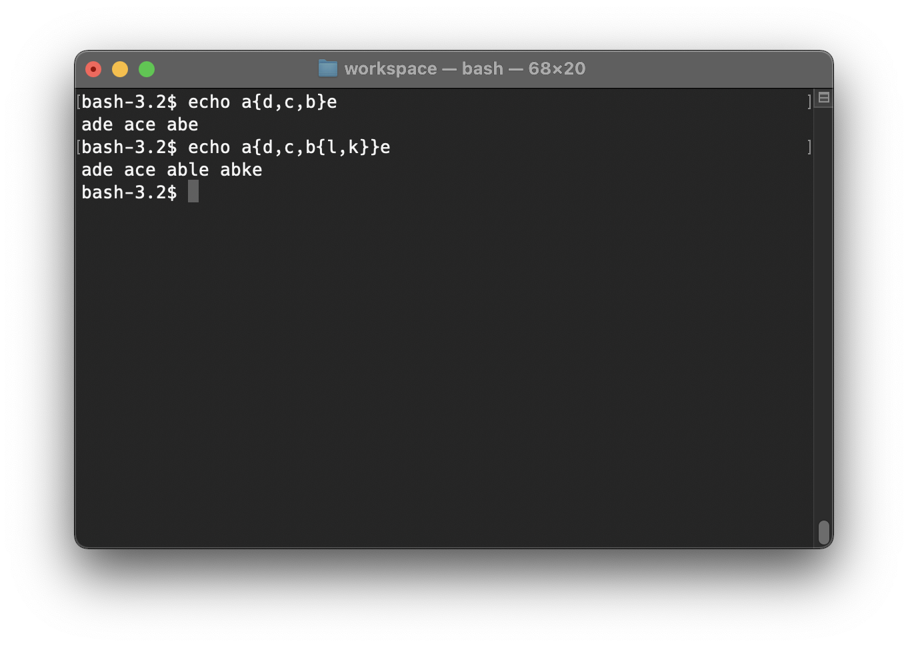
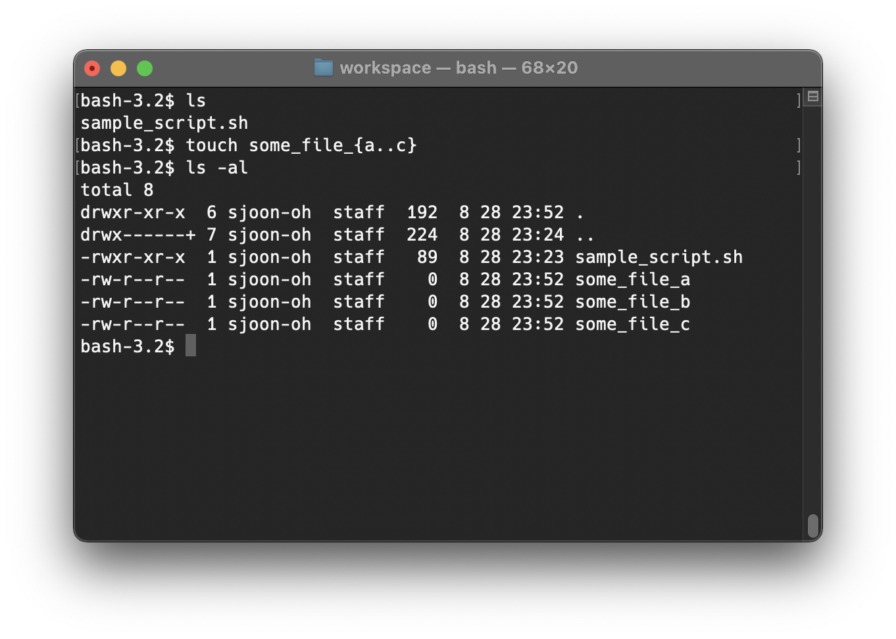
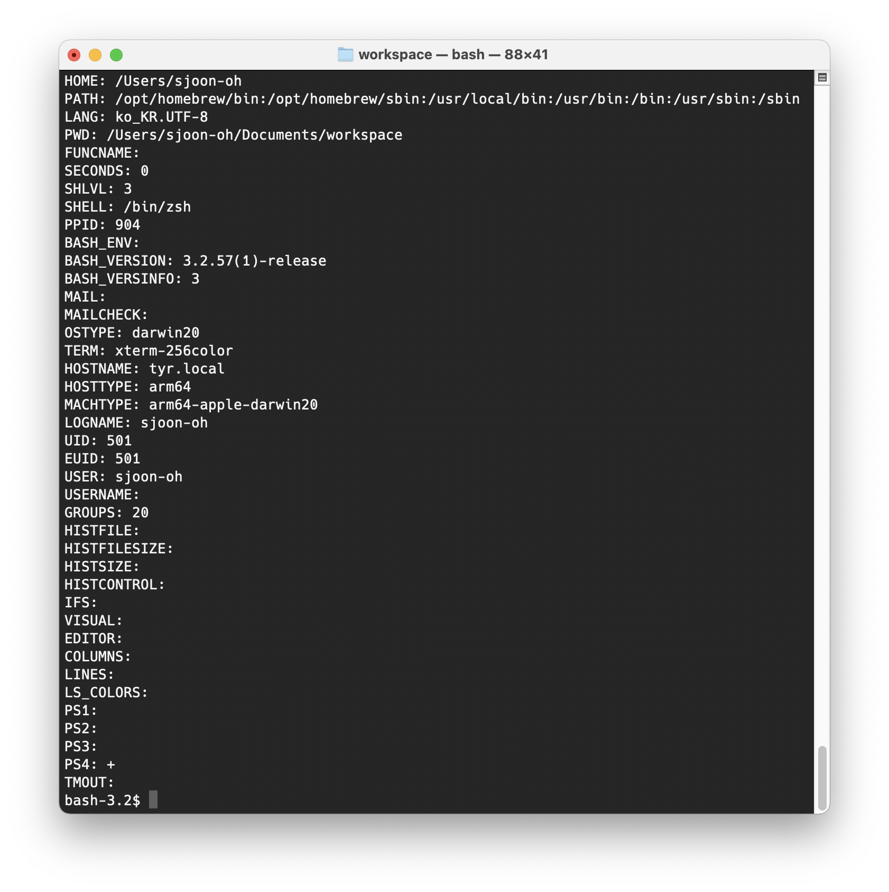

# 쉘 스크립트 문법 정리

리눅스를 사용하면서 많이 사용되지만 또 사용될때만 사용하고 안하는게 쉘 스크립트인 것 같습니다. 그래서인지 늘 헷갈리고 까먹는 내용이라 이번 기회에 정리해보려 합니다. 이번 포스트는 개인 정리 목적의 성격이 강한 글이며 `bash` 기준으로 자주 사용되는 기능 위주로 설명되어 있습니다. 주로 사용한 참고자료는 [Bash Reference Manual](https://www.gnu.org/software/bash/manual/html_node/index.html#SEC_Contents) 입니다.

<!-- more -->

## 변수 (Variables)

### 변수 타입 (Variables Type)

쉘 스크립트가 구동될 때 변수에는 아래와 같이 크게 3가지의 종류가 있습니다.

| Variable | Description |
|---|---|
| Local Variables | 현재 쉘 인스턴스에서 유효한 변수입니다. |
| Environment Variables | 여러 커맨드가 공유할 수 있는 변수입니다. `bash`의 내장 커맨드 `export`으로 변수를 생성할 수 있습니다. |
| Special Variables | 인수 전체나 인수의 전체 개수 등을 나타내는 특수 변수입니다. |

### 변수 선언

변수 선언은 아래와 같습니다. 여기서 주의할 점은 `=`` 앞 또는 뒤로 띄어쓰기가 삽입되면 안됩니다.

```sh
#!/bin/bash

some_str="Some String!!"
some_val=100

echo "${some_str}"
echo "${some_val}"
```



배열은 아래와 같이 선언합니다.

```sh
#!/bin/bash

arr=(10, 20, 30)
arr2=("some string 1", "some string 2")

printf "arr: ${arr[*]}\n"
printf "arr: ${arr2[*]}\n"
```



## Expansions

Bash Reference Manual에서 설명하는 Shell Expansion의 종류는 아래와 같습니다. 이 포스트에서는 간단하게 일부만 설명하겠습니다.

| Expansion | Description |
|---|---|
| Brace Expansion | Expansion of expressions within braces. |
| Tilde Expansion | Expansion of the ~ character. |
| Shell Parameter Expansion | How Bash expands variables to their values. |
| Command Substitution | Using the output of a command as an argument. |
| Arithmetic Expansion | How to use arithmetic in shell expansions. |
| Process Substitution | A way to write and read to and from a command. |
| Word Splitting | How the results of expansion are split into separate arguments. |
| Filename Expansion | A shorthand for specifying filenames matching patterns. |
| Quote Removal | How and when quote characters are removed from words. |

### Brace Expansion

Brace Expansion은 임의의 문자열을 생성하는 방법입니다. Bracket을 사용하여 아래와 같이 문자열을 생성할 수 있습니다. 여기서 `{}`는 중첩이 가능합니다. 




직접 `,`를 사용하여 반복되는 인자를 지정할 수 있고, 숫자와 글자를 이용하여 아래와 같은 형식으로 지정할 수도 있습니다. 여기에서 `x`와 `y`는 정수 또는 `char` 형이며 `incr` 인수는 옵션으로 지정이 가능합니다.

```
{x..y[..incr]}
```



### Tilde Expansion

Tilde-prefix는 주로 디렉토리와 관련된 단축어라고 생각하면 됩니다. 일부만 소개하면 아래와 같습니다.

| Expansion | Description |
|---|---|
| `~` | `$HOME` |
| `~+/foo` | `$PWD/foo` |
| `~-/foo` | `${OLDPWD-'~-'}/foo` |

### Shell Parameter Expansions

Shell Parameter Expansion, Command Substition, Arithmetic Expansion의 경우 `$` 연산자가 사용됩니다. 기본적인 형식은

```
${parameter}
```

와 같고, 아래와 같은 Expansion을 사용할 수 있습니다.

| Form | Description |
|---|---|
| `${parameter:-word}` | `parameter`가 `unset`이나 `null`이 아니면 `parameter`의 값을 나타내고, 그게 아니라면 `word`의 값을 나타냅니다. |
| `${parameter:=word}` | `parameter`가 `unset`이나 `null`이 아니면 `parameter`의 값을 나타내고, 그게 아니라면 `parameter`에 `word`의 값을 대입한 후 그 값을 나타냅니다. |
| `${parameter:?word}` | `parameter`가 `unset`이나 `null`이 아니면 `parameter`의 값을 나타내고, 그게 아니라면 `word`는 standard error으로 넘어가고 쉘은 종료합니다. |
| `${parameter:+word}` | `parameter`가 `unset`이나 `null`인 경우 아무것도 나타내지 않으며, 그게 아니라면 `word`의 값을 나타냅니다. |
| `${parameter:offset}` | `parameter`의 `offset` 다음 부터 문자열을 추출합니다. |
| `${parameter:offset:length}` | `parameter`의 `offset` 다음 부터 문자열을 `length` 길이 만큼 추출합니다. |
| `${!prefix*}` | 선언된 변수 중에서 `prefix`가 포함된 변수명을 추출합니다. |
| `${!prefix@}` | 선언된 변수 중에서 `prefix`가 포함된 변수명을 추출합니다. 큰따옴표 안에서 사용되는 경우 각 변수 이름은 분리된 단어로 나타납니다. |
| `${!array[@]}` | 배열 변수 `arr`의 key 리스트로 치환합니다. |
| `${!array[*]}` | 배열 변수 `arr`의 key 리스트로 치환합니다. 큰따옴표 안에서 사용되는 경우 각 문자열은 분리된 단어로 나타납니다. |
| `${#parameter}` | `parameter`의 문자열 길이를 반환합니다. 만일 `parameter`가 `*`이거나 `@`인 경우에는 Positional Parameter(스크립트 실행 시 지정하는 옵션)의 개수를 반환하고, 배열인 경우 첫 번째 요소의 길이를 반환합니다. |
| `${parameter#word}` | `parameter`의 앞 부분에서부터 가장 짧게 일치하는 `word`를 제거합니다. 만약 `parameter`가 `*`이거나 `@`인 경우에는 각각의 Positional Parameter에 적용되고 리스트 형식으로 치환됩니다. |
| `${parameter##word}` | `parameter`의 앞 부분에서부터 가장 길게 일치하는 `word`를 제거합니다. 만약 `parameter`가 `*`이거나 `@`인 경우에는 각각의 Positional Parameter에 적용되고 리스트 형식으로 치환됩니다. |
| `${parameter%word}` | `parameter`의 뒷 부분에서부터 가장 짧게 일치하는 `word`를 제거합니다. 만약 `parameter`가 `*`이거나 `@`인 경우에는 각각의 Positional Parameter에 적용되고 리스트 형식으로 치환됩니다. |
| `${parameter%%word}` | `parameter`의 뒷 부분에서부터 가장 길게 일치하는 `word`를 제거합니다. 만약 `parameter`가 `*`이거나 `@`인 경우에는 각각의 Positional Parameter에 적용되고 리스트 형식으로 치환됩니다. |
| `${parameter/pattern/string}` | `parameter`에서 처음 `pattern`과 일치한 단어를 `string`으로 변경되어 나타납내다. |
| `${parameter//pattern/string}` | `parameter`에서 모든 `pattern`과 일치한 단어를 `string`으로 변경되어 나타납내다. |
| `${parameter#pattern/string}` | `parameter`에서 앞부분이 `pattern`과 일치한 단어를 `string`으로 변경되어 나타납내다.  |
| `${parameter%pattern/string}` | `parameter`에서 뒷부분이 `pattern`과 일치한 단어를 `string`으로 변경되어 나타납내다. |
| `${parameter^pattern}` | `parameter`의 문자열을 `pattern`에 일치하는 첫 문자를 대문자로 변경합니다. `pattern`이 지정되지 않는 경우 첫 글자만 대문자로 변경합니다. |
| `${parameter^^pattern}` | `parameter`의 문자열을 `pattern`에 일치하는 모든 문자를 대문자로 변경합니다. `pattern`이 지정되지 않는 경우 모든 문자가 대문자로 변경합니다. |
| `${parameter,pattern}` | `parameter`의 문자열을 `pattern`에 일치하는 첫 문자를 소문자로 변경합니다. `pattern`이 지정되지 않는 경우 첫 글자만 소문자로 변경합니다. |
| `${parameter,,pattern}` | `parameter`의 문자열을 `pattern`에 일치하는 모든 문자를 소문자로 변경합니다. `pattern`이 지정되지 않는 경우 모든 문자가 소문자로 변경합니다. |


### Command Substitution

Command Substitution은 명령어 실행의 결과를 치환하는 경우 사용됩니다. 기본 형식은 아래와 같습니다.

```sh
$(command)
`command`
```

기본적으로 bash의 경우 subshell environment에서 명령어를 실행 후 standard output으로 결과를 내보냅니다. 


## 환경 변수

아래는 bash에서 이용되는 중요 환경변수 입니다. 이는 예약 변수(Reserved Variable)이라고도 하며 `.bash_profile`에서 정의합니다.

출처: https://blog.gaerae.com/2015/01/bash-hello-world.html

| Variable | Description |
|---|---|
|`HOME`| 사용자의 홈 디렉토리 |
|`PATH`| 실행 파일을 찾을 경로 |
|`LANG`| 프로그램 사용시 기본 지원되는 언어 |
|`PWD`| 사용자의 현재 작업중인 디렉토리 |
|`FUNCNAME`| 현재 함수 이름 |
|`SECONDS`| 스크립트가 실행된 초 단위 시간 |
|`SHLVL`| 쉘 레벨(중첩된 깊이를 나타냄) |
|`SHELL	`| 로그인해서 사용하는 쉘 |
|`PPID`| 부모 프로세스의 PID |
|`BASH`| BASH 실행 파일 경로 |
|`BASH_ENV`| 스크립트 실행시 BASH 시작 파일을 읽을 위치 변수 |
|`BASH_VERSION`| 설치된 BASH 버전 |
|`BASH_VERSINFO`| `BASH_VERSINFO[0]`~`BASH_VERSINFO[5]` 배열로 상세정보 제공 |
|`MAIL`| 메일 보관 경로 |
|`MAILCHECK`| 메일 확인 시간 |
|`OSTYPE`| 운영체제 종류 |
|`TERM`| 로긴 터미널 타입 |
|`HOSTNAME`| 호스트 이름 |
|`HOSTTYPE`| 시스템 하드웨어 종류 |
|`MACHTYPE`| 머신 종류(`HOSTTYPE`과 같은 정보지만 조금더 상세하게 표시됨) |
|`LOGNAME`| 로그인 이름 |
|`UID`| 사용자 `UID` |
|`EUID`| `su` 명령에서 사용하는 사용자의 유효 아이디 값(`UID`와 `EUID` 값은 다를 수 있음) |
|`USER`| 사용자의 이름 |
|`USERNAME`| 사용자 이름 |
|`GROUPS`| 사용자 그룹(/etc/passwd 값을 출력) |
|`HISTFILE`| `history` 파일 경로 |
|`HISTFILESIZE`| `history` 파일 크기 |
|`HISTSIZE`| `history` 저장되는 개수 |
|`HISTCONTROL`| 중복되는 명령에 대한 기록 유무 |
|`IFS`| 입력 필드 구분자(기본값: ` ` - 빈칸), Internal Field Separator, 문자열 중간에서 단어를 구분하는 문자열을 지정. |
|`VISUAL`| VISUAL 편집기 이름 |
|`EDITOR`| 기본 편집기 이름 |
|`COLUMNS`| 현재 터미널이나 윈도우 터미널의 컬럼 수 |
|`LINES`| 터미널의 라인 수 |
|`LS_COLORS`| ls 명령의 색상 관련 옵션 |
|`PS1`| 기본 프롬프트 변수(기본값: `bash\$`) |
|`PS2`| 보조 프롬프트 변수(기본값: `>`), 명령을 "\"를 사용하여 명령 행을 연장시 사용됨 |
|`PS3`| 쉘 스크립트에서 select 사용시 프롬프트 변수(기본값: `#?`) |
|`PS4`| 쉘 스크립트 디버깅 모드의 프롬프트 변수(기본값: `+`) |
|`TMOUT`| `0`이면 제한이 없으며 `time`시간 지정시 지정한 시간 이후 로그아웃 |

이를 출력해보면 아래와 같이 나타납니다. (MacOS 기준)



## 매개 변수 (Parameters)

### Positional Parameters

Positional Parameter (위치 파라미터)는 쉘 함수의 인수 참조에 사용됩니다. 

출처: https://blog.gaerae.com/2015/01/bash-hello-world.html

| Parameter | Description |
|---|---|
| `$0` | 실행된 스크립트 이름 참조 |
| `$1` | `$1` `$2` `$3`... `${10}` 인자 순서대로 번호가 부여, 10번째부터는 `{}` 이용 |
| `$*` | 모든 인수를 스페이스로 구분 지은 문자열로 나열해 참조 |
| `$@` | 전체 인자 값($* 동일하지만 쌍따옴표로 변수를 감싸면 다른 결과 나옴) 참조 |
| `$#` | 매개 변수의 총 개수를 참조 |


### Special Parameters

| Parameter | Description |
|---|---|
| `$?` | 종료 상태 참조 |
| `$!` | 최근 생성한 프로세스 ID 참조 |
| `$$` | 자신의 프로세스 ID 참조 |
| `$-` | 쉘 옵션 플래그 참조 |
| `$_` | 직전에 실행한 커맨드의 가장 마지막 인수를 참조 |

## 조건문 if

`if` 조건문 형식은 아래와 같습니다.

```sh
if [ condition_1 ]; then
    do_something_1
elif [ condition_2 ]; then
    do_something_2
else
    do_something_3
fi
```

이때 쉘 내에서의 조건 판단은 아래와 같은 형식을 사용할 수 있습니다.

```
(1) test condition_1
(2) [ condition_1]
```

`[]`는 `test`의 별명일 뿐 수행되는 동작은 같습니다. 

출처: https://blog.gaerae.com/2015/01/bash-hello-world.html

### 정수 비교

| Op | Description |
|---|---|
| `arg1 -eq arg2` | arg1와 arg2가 같으면 참 |
| `arg1 -ne arg2` | arg1와 arg2가 같지 않으면 참 |
| `arg1 > arg2`, `arg1 -gt arg2` | 더 큼(> 이중 소괄호에서 사용 가능) |
| `arg1 >= arg2` , `arg1 -ge arg2` | 더크거나 같음(>= 이중 소괄호에서 사용 가능) |
| <, -lt | 더 작음(< 이중 소괄호에서 사용 가능) |
| <=, -le | 더 작거나 같음(<= 이중 소괄호에서 사용 가능) |

### 문자열 비교

=, ==	같음
!=	같지 않음
<	ASCII 알파벳 순서에 더 작음
>	ASCII 알파벳 순서에서 더 큼
-z	문자열이 NULL, 길이가 0인 경우
-n	문자열이 NULL이 아님
${변수}	문자열이 NULL이 아님

### 파일 비교 

문자	설명
-e	파일이 존재
-f	파일이 존재하고 일반 파일인 경우(디렉토리 혹은 장치파일이 아닌 경우)
-s	파일이 존재하고 0보다 큰 경우
-d	파일이 존재하고 디렉토리인 경우
-b	파일이 존재하고 블록장치 파일인 경우
-c	파일이 존재하고 캐릭터 장치 파일인 경우
-p	파일이 존재하고 FIFO인 경우
-h	파일이 존재하고 한 개 이상의 심볼릭 링크가 설정된 경우
-L	파일이 존재하고 한 개 이상의 심볼릭 링크가 설정된 경우
-S	파일이 소켓 디바이스인 경우
-t	파일이 디스크립터가 터미널 디바이스와 연관이 있음
-r	파일이 존재하고 읽기 가능한 경우
-w	파일이 존재하고 쓰기가 가능한 경우
-x	파일이 존재하고 실행 가능한 경우
-g	파일이 존재하고 SetGID가 설정된 경우
-u	파일이 존재하고 SetUID가 설정된 경우
-k	파일이 존재하고 스티키 비트(Sticky bit)가 설정된 경우
-O	자신이 소유자임
-G	그룹 아이디가 자신과 같음
-N	마지막으로 읽힌 후에 변경 됐음
file1 -nt file2	file1 파일이 file2 파일보다 최신임
file1 -ot file2	file1 파일이 file2 파일보다 예전것임
file1 -ef file2	file1 파일과 file2 파일이 같은 파일을 하드 링크하고 있음
!	조건이 안 맞으면 참(예: ! -e file)

## 참고 자료

1. https://twpower.github.io/131-simple-shell-script-syntax
2. https://www.fun-coding.org/linux_basic3.html
3. https://www.javatpoint.com/shell-scripting-variables
4. https://www.tutorialspoint.com/unix/unix-using-variables.htm
5. https://www.gnu.org/software/bash/manual/html_node/Shell-Expansions.html
6. https://jhnyang.tistory.com/154
7. https://blog.gaerae.com/2015/01/bash-hello-world.html