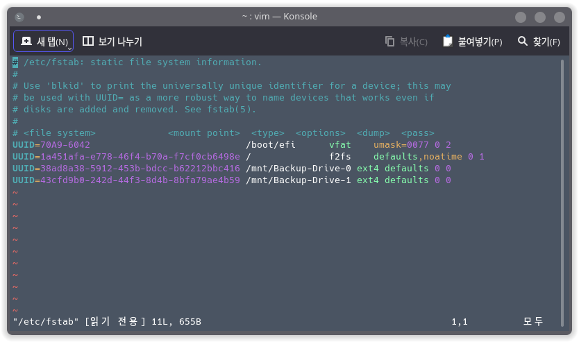

# 드라이브 자동 마운트 설정하기

연구실에 들어와 데스크탑을 세팅하는 과정에서 /dev/sdb로 잡혀있는 SATA SSD 를 마운트 해야 할 일이 생겼습니다. 이전 아치 리눅스를 이용 중일때는 설정해 둔 것이 있었지만 오랜만에 하려니 방법을 잊어버려 찾게 되더군요. 기록 용으로 여기에 남겨두려 합니다.

<!--more-->

참고 시 좋은 자료: [https://wiki.archlinux.org/title/Fstab#Usage](https://wiki.archlinux.org/title/Fstab#Usage)

## 디스크 마운트 하기

일반적으로 리눅스 환경에서 간단히 `mount` 명령어를 사용해서 디스크를 마운트 시킵니다. 예를 들어 /dev/sdb 를 /mnt/spare-drive 폴더에 마운트 해야 한다면,

```zsh
$ sudo mount -t ext4 /dev/sdb /mnt/spare-drive
```

와 같이 `-t` 옵션으로 파일시스템 타입을 지정하고 디바이스와 경로를 주면 됩니다. 이 외에도 권한과 같은 옵션을 추가로 줄 수 있으나 일반적인 사용 방법은 위와 같습니다. 마운트 해제 시 `umount` 명령어를 수행합니다.

```zsh
$ sudo umount /mnt/spare-drive
```

## File System Table 수정

문제는, 시스템을 부팅 시에는 자동적으로 디스크가 마운트 되지 않습니다. 일반 데스크탑 환경에서는 PCManFM, Dolphin, Thunar과 같은 File Manager로 쉽게 클릭 한 번으로 마운트/해제가 가능하지만 CLI는 불가능합니다. 그리고 이전에, 너무 귀찮죠.

리눅스는 `fstab` (File System Table) 이라는 설정 파일을 가지고 있습니다. 이 설정 파일은 시스템 시동 시 자동으로 외부 저장장치를 마운트 시킬 수 있도록 도와줍니다. `systemd`를 이용한 자동 마운트 설정법도 있으나, 조금 복잡하므로 여기서는 설정 파일만 다루도록 하겠습니다. `fstab`은 대부분의 configuration file이 위치한 `/etc` 폴더에 있습니다. 


### `fstab` 구성

fstab에는 몇 가지의 항목으로 구성되어 있고, 공백 또는 `TAB`으로 구분합니다. 간단하게는 아래와 같습니다.



**File system**: 파일 시스템 장치의 이름을 나타냅니다. `LABEL`을 사용하거나, `/dev/sdb`와 같이 작성하거나, 디스크의 UUID(niversally Unique IDentifier)를 사용하여 지정합니다. UUID는 `lsblk`, `` 명령어로 확인할 수 있습니다.

**Mount Point**: 어느 경로로 마운트 시킬지 지정하는 필드입니다. 제 설정값의 경우는 `/mnt/Backup-Drive-0` 경로로 지정하고 있습니다.


**FileSystem Type**: 파일 시스템 종류를 지정합니다. 사용 가능한 파일 시스템으로는 `ext`, `ext2`, `ext3`, `ext4`, `iso9660`(CD/DVD Read-only), `nfs`(Network-FS), `ufs`(Unix System Standard), `vfat`, `msdos`, `hfs`(Mac), `hpfs`, `sysv`(Unix System V), `ramdisk` 등이 있습니다. 이 파일 시스템 종류에 따라 지정 가능한 옵션이 달라지기도 합니다.

**Mount Option**: 마운트 옵션을 지정합니다. 상세하게는 더 많은 옵션이 있으나 간단하게 몇 가지만 정리합니다.

- `defaults`: `rw`, `nouser`, `auto`, `exec`, `suid` 옵션 지정
- `auto`: 시스템 시작 시 자동 마운트
- `noauto`: 시스템 시작 시 자동 마운트 해제
- `exec`: 실행 파일이 실행 가능하도록 설정
- `noexec`: 실행 파일이 실행 불가능
- `suid`:SetUID와 SetGID 사용 가능
- `nosuid`: SetUID와 SetGID의 사용 불가능
- `ro`: Read-only
- `rw`: Read and Write
- `user`:일반 계정이 `mount` 가능하도록 설정
- `nouser`: 일반 계정 `mount` 불가능
- `usrquota`: 일반 계정 사용자의 디스크 용량을 제한
- `grpquota`: 그룹의 용량 설정
- `uid`, `gid`: 특정 사용자와 그룹 지정
- `umask`, `fmask`: rwx 권한 지정

**Dump**: 백업 여부를 지정합니다. `0`이면 비활성화 하고, `1`이면 활성화합니다.

**Pass**: `fsck`에 의한 무결성 검사 우선순위를 지정합니다.

- 0: 무결성 검사를 하지 않음
- 1: Priority 1, `/`에 대부분 지정
- 2: Priority 1, `root` 이후 검사


## 예시: ext4 자동 마운트 하기 (User)

주의할 점은 위의 Mount option은 파일 시스템 별로 사용 가능하거나 사용 불가능한 옵션이 존재합니다. `/etc/fstab` 파일을 실수로 잘못 작성했거나, 혹은 제대로 작성했지만 지원하지 않는 옵션을 지정한다면 대부분 부팅 과정에서 emergency mode로 넘어갈 가능성이 있습니다. 

예를 들어, `ext4` 파일 시스템으로 되어 있는 디스크를 특정 사용자를 지정하여 마운트를 하기 위해 `uid`, `gid` 옵션을 지정하여 `fstab` 파일을 작성한다면 부팅이 되지 않습니다. `ext4`는 위의 옵션을 지원하지 않기 때문입니다. 반면 `default` 옵션만 주게 되면 일반적으로 root 계정만 rwx 권한이 들어갑니다. 즉, 일반 user-privilege로는 파일을 생성하거나 실행할 수 없습니다. 따라서 디렉토리의 권한을 따로 설정해 주어야 합니다. 예를 들어, 

1. `fstab`파일에 마운트 할 폴더를 지정 후 `default` 옵션으로 지정합니다. 
2. Root 계정으로 폴더를 생성하였다면, `chown [user_name]:[user_name] /some_dir` 으로 소유권을 변경합니다. 

일반적인 데스크탑 환경에서는 하나의 사용자만 존재하기 때문에 위의 방법으로 권한을 변경하면 되고, 다중 사용자 환경이라면 그룹 권한을 따로 지정하는 방식을 사용합니다. 
