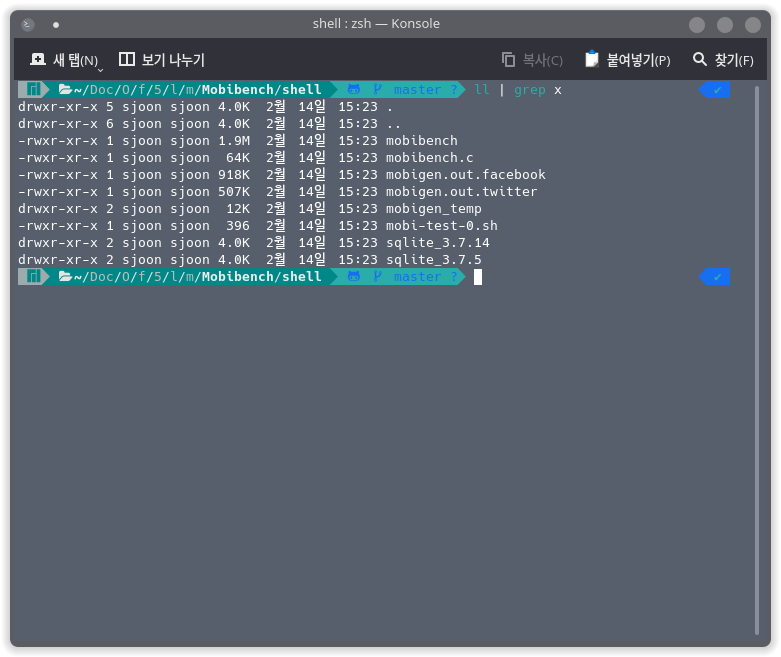
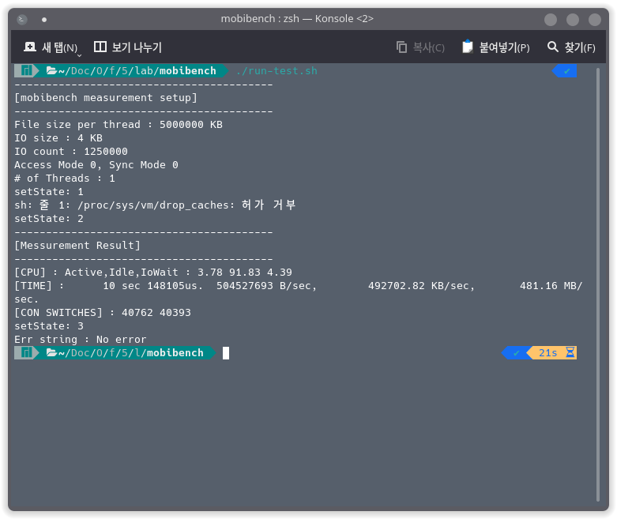
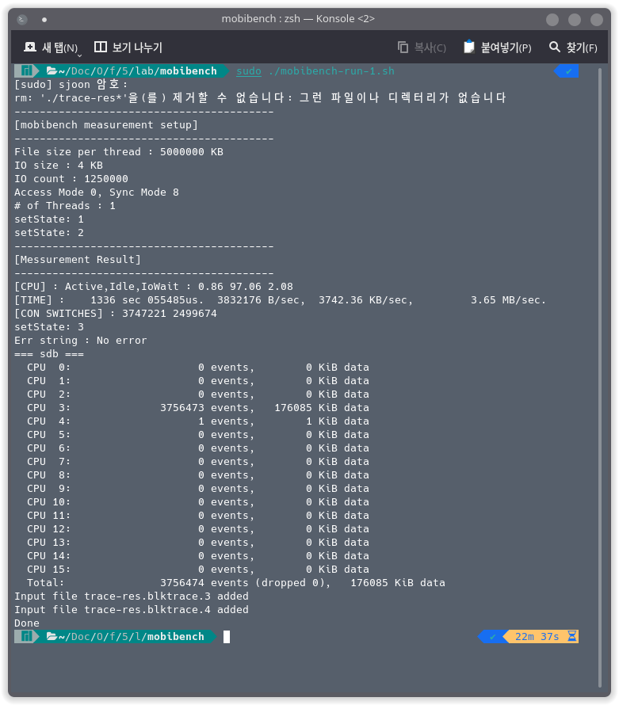
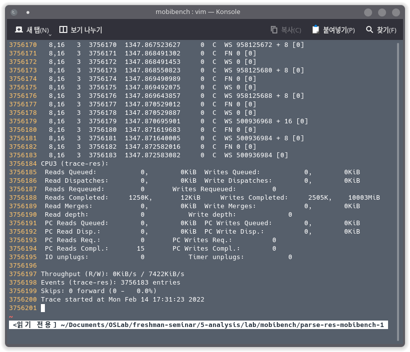
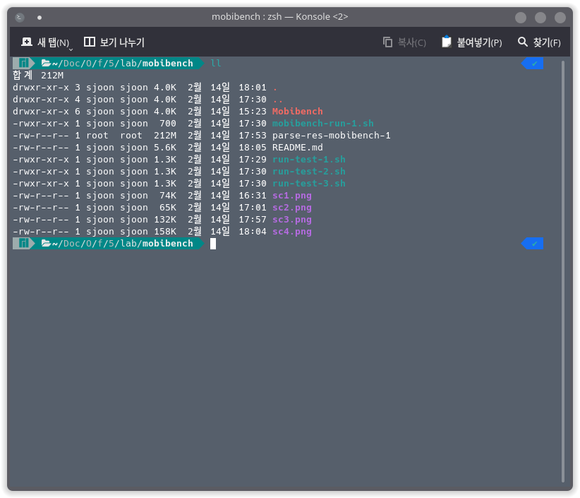
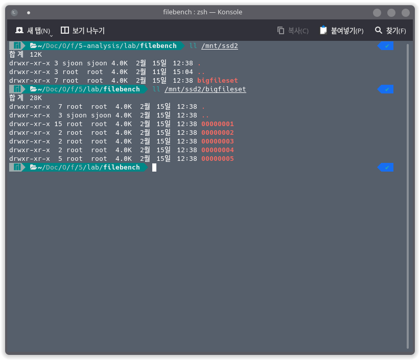

# Essential Tools

> 신입생 세미나 5: Benchmark & Analysis
> 
Author: 2022.02. 오석준

## Test Environment (테스트 환경)
- [Manjaro Linux]() 21.2 Qonos
- Intel Core i7-10700 CPU @ 2.90GHz
- RAM 31.2 GiB

```
$ uname -srvio
Linux 5.16.5-1-MANJARO #1 SMP PREEMPT Tue Feb 1 16:57:14 UTC 2022 unknown GNU/Linux
```

- Main drive `/dev/sda5` : Dual boot
- Sub drive `/dev/sdb` : `mkfs.ext4` (Initial)

기본 명령어는 아래와 같다.

```sh
# Mount & Unmount
$ sudo mount /dev/sdb /mnt/ssd2
$ sudo umount /mnt/ssd2

# Make file system
$ sudo mkfs.ext4 -f /dev/sdb
$ sudo mkfs.xfs -f /dev/sdb
$ sudo mkfs.f2fs -f /dev/sdb
```

## Mobibench

Mobibench는 모바일 환경에서 I/O와 SQLite의 성능을 측정하기 위해, 고안된 툴이다. 단일 I/O 실험에 대한 편한 command line을 제공하기 때문에 스토리지 디바이스나 파일 시스템의 기본적인 성능을 측정하는데 많이 이용된다. 이번 포스트에서는 반복되는 단일 I/O와 sync 동작의 효율을 파일 시스템 별로 비교한다.


### Installation (설치)
---

```sh
$ git clone https://github.com/ESOS-Lab/Mobibench
```

프로젝트 파일 다운로드 후 `make` 빌드한다.

```sh
$ cd ./Mobibench/shell && make
```

### Shell-Version Use Cases
---

빌드 후 실행파일은 `Mobibench/shell` 디렉토리에 존재한다. 



아래와 같이 실행한다.

```
mobibench [-p pathname] [-f file_size_Kb] [-r record_size_Kb] [-a access_mode] [-h] [-y sync_mode] [-t thread_num] [-d db_mode] [-n db_transcations] [-j SQLite_journalmode] [-s SQLite_syncmode] [-g replay_script] [-q]
```                                     
                                     
* `-p` : set path name 
  - default `./mobibench`
* `-f` : set file size in KBytes 
  - default `1024`
* `-r` : set record size in KBytes 
  - default `4`
* `-a` : set access mode 
  - `0` : Write
  - `1` : Random Write
  - `2` : Read
  - `3` : Random Read
  - `4` : Append (최근 커밋에 추가)
  - default `0`
* `-y` : set sync mode 
  - `0` : Normal 
  - `1` : O_SYNC
  - `2` : fsync
  - `3` : O_DIRECT
  - `4` : Sync+direct
  - `5` : mmap
  - `6` : mmap+MS_ASYNC
  - `7` : mmap+MS_SYNC 
  - `8` : fdatasync
  - default `0`
* `-t` : set number of thread for test 
  - default `1`
* `-d` : enable DB test mode 
  - `0` : insert
  - `1` : update
  - `2` : delete
* `-n` : set number of DB transaction
  - default `10`
* `-j` : set SQLite journal mode 
  - `0` : DELETE
  - `1` : TRUNCATE
  - `2` : PERSIST
  - `3` : WAL
  - `4` : MEMORY
  - `5` : OFF
  - default `1`
* `-s` : set SQLite synchronous mode 
  - `0` : OFF
  - `1` : NORMAL
  - `2` : FULL 
  - default `2`
* `-g` : set replay script (output of MobiGen)
* `-q` : do not display progress(%) message     

### 세 가지 Workload에 대한 실험
--- 

1. 4 KB sequential write followed by `fdatasync()`
2. 4 KB random write followed by `fdatasync()`
3. 4 KB append write followed by `fsync()`

실험 조건은 다음과 같다.

| Device | File Size | Threads |
|:---:|:---:|:---:|
| Apart from OS | 5GB | 1 |

Test script `run-test.sh` 틀을 작성한다. 추가적인 SSD `/dev/sdb`는 `/mnt/ssd2`에 마운트 되어 있다. 

```sh
#!/bin/bash
EXECUTABLE_PATH="./Mobibench/shell"

# Set args here.
PATH_NAME="/mnt/ssd2"
FILE_SIZE=5000000 
RECORD_SIZE=4
ACCESS_MODE=0 
SYNC_MODE=0

NTHREAD=1 # Number of threads

${EXECUTABLE_PATH}/mobibench \
    -p ${PATH_NAME} \
    -f ${FILE_SIZE} \
    -r ${RECORD_SIZE} \
    -a ${ACCESS_MODE} \
    -y ${SYNC_MODE} \
    -t ${NTHREAD} \
```

우선 옵션을 설정하지 않고 기본으로 실행한 결과는 아래와 같다.



세 가지 실험에 대해 위 스크립트의 변수 `ACCESS_MODE`와 `SYNC_MODE`를 각각 아래와 같이 변경한다.

1. 4 KB sequential write followed by `fdatasync()` : `ACCESS_MODE=0`, `SYNC_MODE=8`
2. 4 KB random write followed by `fdatasync()` : `ACCESS_MODE=1`, `SYNC_MODE=8`
3. 4 KB append write followed by `fsync()` : `ACCESS_MODE=4`, `SYNC_MODE=2`


### blktrace와 blkparse
--- 

`blktrace`와 `blkparse`를 설치 후 진행한다. 두 패키지 모두 공식 레포지토리에서 다운로드 가능하다.

```sh
$ sudo pacman -Syu blktrace blkparse
```

Benchmarking은 다음과 같은 순서대로 진행한다.

1. `blktrace` 실행, 관찰할 디바이스 지정
2. Benchmarking tool 실행
3. `blktrace` 종료
4. `blkparse`로 분석


실험 스크립트는 아래와 같이 작성한다. `blktrace`는 현재 shell 세션의 백그라운드에서 먼저 실행시키고 벤치마킹이 끝나면 시그널을 보내 종료시킨다. 이때 출력 파일이 정상적으로 생성될 때까지 `wait`으로 기다린 후 `blkparse`를 진행한다. 이때 `blktrace`와 `mobibench`는 루트 권한을 요구하므로 주의한다.

예를 들면 아래와 같다.

```bash
#!/bin/bash

WORK="mobibench-1"
BENCH_SCRIPT="run-test-1.sh"

TARGET_DEVICE="/dev/sdb"
MOUNT_POINT="/mnt/ssd2"

TRACE_OUTPUT_FILE="trace-res"
PARSE_OUTPUT_FILE="parse-res"

# Check if the session has the root privilege
if [ "$EUID" -ne 0 ]
  then echo "Please run as root"
  exit
fi

# Clear the existing garbage
rm -r ${MOUNT_POINT}/*
rm -r ./${TRACE_OUTPUT_FILE}*

blktrace -d ${TARGET_DEVICE} -o ./${TRACE_OUTPUT_FILE} -a complete &
PID=$!

# Run the benchmark
./${BENCH_SCRIPT} # Doing work

# Shutdown the process
kill -2 ${PID} > /dev/null
wait

blkparse -i ${TRACE_OUTPUT_FILE} -o ${PARSE_OUTPUT_FILE}-${WORK}

# Clear the existing garbage
rm -r ${MOUNT_POINT}/*
rm -r ./trace-res*
echo "Done"
```

예시 파일을 `mobibench-run-1.sh`로 저장하고 실행하면 아래와 같다.

```sh
$ chmod +x mobibench-run-1.sh # Give executable permission
$ sudo ./mobibench-run-1.sh
```



`blkparse`의 결과는 동일 디렉토리의 `parse-res-mobibench-1` 이라는 이름으로 저장된다. 이는 테스트 스크립트의 `PARSE_OUTPUT_FILE`으로 prefix가 지정되어 있다. 많은 로그가 기록되므로 간단하게 아래 부분만 확인하면 아래와 같은 결과를 볼 수 있다.



위와 같은 형식으로 옵션을 달리 주어 스크립트를 만든 후 실행시킨다.



### Results - Outputs
---

#### EXT4

- `blkparse` summary, Test 1: [File](../assets/posts/2022-02-16-mobibench-filebench/blkparse-ext4-mobibench-1-sum.log)
- `blkparse` summary, Test 2: [File](../assets/posts/2022-02-16-mobibench-filebench/blkparse-ext4-mobibench-2-sum.log)
- `blkparse` summary, Test 3: [File](../assets/posts/2022-02-16-mobibench-filebench/blkparse-ext4-mobibench-3-sum.log)

```sh
# Test 1.
-----------------------------------------
[mobibench measurement setup]
-----------------------------------------
File size per thread : 5000000 KB
IO size : 4 KB
IO count : 1250000 
Access Mode 0, Sync Mode 8
# of Threads : 1
setState: 1
-----------------------------------------
[Messurement Result]
-----------------------------------------
[CPU] : Active,Idle,IoWait : 0.84 96.97 2.18
[TIME] :    1286 sec 891294us. 	3978580 B/sec, 	3885.33 KB/sec, 	3.79 MB/sec.
[CON SWITCHES] : 3749093 2499602
setState: 3
Err string : No error

# Test 2.
-----------------------------------------
[mobibench measurement setup]
-----------------------------------------
File size per thread : 5000000 KB
IO size : 4 KB
IO count : 1250000 
Access Mode 1, Sync Mode 8
# of Threads : 1
setState: 1
-----------------------------------------
[Messurement Result]
-----------------------------------------
[CPU] : Active,Idle,IoWait : 0.94 96.53 2.53
[TIME] :    1426 sec 559744us. 	3589054 B/sec, 	3504.94 KB/sec, 	3.42 MB/sec. 876.23 IOPS(4KB) 
[CON SWITCHES] : 3749238 2499177
setState: 3
Err string : No error

# Test 3.
-----------------------------------------
[mobibench measurement setup]
-----------------------------------------
File size per thread : 5000000 KB
IO size : 4 KB
IO count : 1250000 
Access Mode 4, Sync Mode 2
# of Threads : 1
setState: 1
setState: 2
-----------------------------------------
[Messurement Result]
-----------------------------------------
[CPU] : Active,Idle,IoWait : 1.25 95.87 2.89
[TIME] :    3373 sec 008880us. 	1517933 B/sec, 	1482.36 KB/sec, 	1.45 MB/sec.
[CON SWITCHES] : 2501912 2500661
setState: 3
Err string : No error
```


#### XFS

- `blkparse` summary, Test 1: [File](../assets/posts/2022-02-16-mobibench-filebench/blkparse-xfs-mobibench-1-sum.log)
- `blkparse` summary, Test 2: [File](../assets/posts/2022-02-16-mobibench-filebench/blkparse-xfs-mobibench-2-sum.log)
- `blkparse` summary, Test 3: [File](../assets/posts/2022-02-16-mobibench-filebench/blkparse-xfs-mobibench-3-sum.log)

```sh
# Test 1.
-----------------------------------------
[mobibench measurement setup]
-----------------------------------------
File size per thread : 5000000 KB
IO size : 4 KB
IO count : 1250000 
Access Mode 0, Sync Mode 8
# of Threads : 1
setState: 1
setState: 2
-----------------------------------------
[Messurement Result]
-----------------------------------------
[CPU] : Active,Idle,IoWait : 0.80 96.50 2.70
[TIME] :    1355 sec 563535us.  3777027 B/sec,  3688.50 KB/sec,         3.60 MB/sec.
[CON SWITCHES] : 4998595 2499002
setState: 3
Err string : No error

# Test 2.
-----------------------------------------
[mobibench measurement setup]
-----------------------------------------
File size per thread : 5000000 KB
IO size : 4 KB
IO count : 1250000 
Access Mode 1, Sync Mode 8
# of Threads : 1
setState: 1
setState: 2
-----------------------------------------
[Messurement Result]
-----------------------------------------
[CPU] : Active,Idle,IoWait : 0.87 96.60 2.53
[TIME] :    1354 sec 912765us.  3778841 B/sec,  3690.27 KB/sec,         3.60 MB/sec. 922.57 IOPS(4KB) 
[CON SWITCHES] : 4996833 2499118
setState: 3
Err string : No error

# Test 3.
-----------------------------------------
[mobibench measurement setup]
-----------------------------------------
File size per thread : 5000000 KB
IO size : 4 KB
IO count : 1250000 
Access Mode 4, Sync Mode 2
# of Threads : 1
setState: 1
setState: 2
-----------------------------------------
[Messurement Result]
-----------------------------------------
[CPU] : Active,Idle,IoWait : 0.61 99.39 0.00
[TIME] :    2869 sec 356446us.  1784372 B/sec,  1742.55 KB/sec,         1.70 MB/sec.
[CON SWITCHES] : 6249973 3750001
setState: 3
Err string : No error
```


#### F2FS

- `blkparse` summary, Test 1: [File](../assets/posts/2022-02-16-mobibench-filebench/blkparse-f2fs-mobibench-1-sum.log)
- `blkparse` summary, Test 2: [File](../assets/posts/2022-02-16-mobibench-filebench/blkparse-f2fs-mobibench-2-sum.log)
- `blkparse` summary, Test 3: [File](../assets/posts/2022-02-16-mobibench-filebench/blkparse-f2fs-mobibench-3-sum.log)

```sh
# Test 1.
-----------------------------------------
[mobibench measurement setup]
-----------------------------------------
File size per thread : 5000000 KB
IO size : 4 KB
IO count : 1250000 
Access Mode 0, Sync Mode 8
# of Threads : 1
setState: 1
-----------------------------------------
[Messurement Result]
-----------------------------------------
[CPU] : Active,Idle,IoWait : 0.79 97.48 1.73
[TIME] :    1334 sec 482310us. 	3836694 B/sec, 	3746.77 KB/sec, 	3.66 MB/sec.
[CON SWITCHES] : 3751822 2500995
setState: 3
Err string : No error

# Test 2.
-----------------------------------------
[mobibench measurement setup]
-----------------------------------------
File size per thread : 5000000 KB
IO size : 4 KB
IO count : 1250000 
Access Mode 1, Sync Mode 8
# of Threads : 1
setState: 1
-----------------------------------------
[Messurement Result]
-----------------------------------------
[CPU] : Active,Idle,IoWait : 0.72 97.50 1.79
[TIME] :    1322 sec 666252us. 	3870969 B/sec, 	3780.24 KB/sec, 	3.69 MB/sec. 945.06 IOPS(4KB) 
[CON SWITCHES] : 3752132 2501007
setState: 3
Err string : No error

# Test 3.
-----------------------------------------
[mobibench measurement setup]
-----------------------------------------
File size per thread : 5000000 KB
IO size : 4 KB
IO count : 1250000 
Access Mode 4, Sync Mode 2
# of Threads : 1
setState: 1
setState: 2
-----------------------------------------
[Messurement Result]
-----------------------------------------
[CPU] : Active,Idle,IoWait : 0.43 98.16 1.41
[TIME] :    1275 sec 418097us. 	4014370 B/sec, 	3920.28 KB/sec, 	3.83 MB/sec.
[CON SWITCHES] : 6248672 3750094
setState: 3
Err string : No error
```


## Filebench

Filebench는 워크로드를 쉽게 생성하고, 사용할 수 있게 하기 위해 고안된 툴이다. WML 스크립트 형태로 워크로드를 생성 및 사용할 수 있고, 기본적으로 다양한 워크로드를 제공하고, 생성 또한 용이하다. 이번 포스트에서는 fileserver(data-intensive), varmail(metadata-intensive) 워크로드의 성능을 파일 시스템 별로 비교한다.

### Installation (설치)
---

우선 libtoolize와 automake 툴이 설치되어있는지 확인한다. 

```sh
$ which libtoolize
$ which automake
```

그리고 다음 명령어를 실행한다. 

```sh
$ libtoolize
$ aclocal
$ autoheader
$ automake --add-missing
$ autoconf
$ ./configure
$ make
$ sudo make install
```

그러면 `/usr/local/bin/filebench` 경로에 등록되면서 `filebench`가 실행 가능하다.

```sh
$ sudo filebench -f <workload file>
```

### 세 가지 Workload에 대한 실험
---

실험 Workload는 [Workload Model Language](https://github.com/filebench/filebench/wiki/Workload-model-language)을 사용하여 정의한다. 두 가지의 workload(fileserver와 varmail)에 대한 WML 파일은 `/workload` 디렉토리에 위치하고 있다. 이 파일을 수정하여 `filebench`에 지정해준다.

#### fileserver.f

파일이 쓰여질 디렉토리 `$dir`을 마운트 시킨 위치로 지정하고, `$nthread` 값을 변경하면서 `filebench`를 실행한다.

```
set $dir=/mnt/ssd2
set $nfiles=10000
set $meandirwidth=20
set $filesize=cvar(type=cvar-gamma,parameters=mean:131072;gamma:1.5)
set $nthreads=1
set $iosize=1m
set $meanappendsize=16k
set $runtime=60

define fileset name=bigfileset,path=$dir,size=$filesize,entries=$nfiles,dirwidth=$meandirwidth,prealloc=80

define process name=filereader,instances=1
{
  thread name=filereaderthread,memsize=10m,instances=$nthreads
  {
    flowop createfile name=createfile1,filesetname=bigfileset,fd=1
    flowop writewholefile name=wrtfile1,srcfd=1,fd=1,iosize=$iosize
    flowop closefile name=closefile1,fd=1
    flowop openfile name=openfile1,filesetname=bigfileset,fd=1
    flowop appendfilerand name=appendfilerand1,iosize=$meanappendsize,fd=1
    flowop closefile name=closefile2,fd=1
    flowop openfile name=openfile2,filesetname=bigfileset,fd=1
    flowop readwholefile name=readfile1,fd=1,iosize=$iosize
    flowop closefile name=closefile3,fd=1
    flowop deletefile name=deletefile1,filesetname=bigfileset
    flowop statfile name=statfile1,filesetname=bigfileset
  }
}

echo  "File-server Version 3.0 personality successfully loaded"

run $runtime
```

#### varmail.f

동일하게 파일이 쓰여질 디렉토리 `$dir`을 마운트 시킨 위치로 지정하고, `$nthread` 값을 변경하면서 `filebench`를 실행한다.

```
set $dir=/mnt/ssd2/
set $nfiles=1000
set $meandirwidth=1000000
set $filesize=cvar(type=cvar-gamma,parameters=mean:16384;gamma:1.5)
set $nthreads=1
set $iosize=1m
set $meanappendsize=16k

define fileset name=bigfileset,path=$dir,size=$filesize,entries=$nfiles,dirwidth=$meandirwidth,prealloc=80

define process name=filereader,instances=1
{
  thread name=filereaderthread,memsize=10m,instances=$nthreads
  {
    flowop deletefile name=deletefile1,filesetname=bigfileset
    flowop createfile name=createfile2,filesetname=bigfileset,fd=1
    flowop appendfilerand name=appendfilerand2,iosize=$meanappendsize,fd=1
    flowop fsync name=fsyncfile2,fd=1
    flowop closefile name=closefile2,fd=1
    flowop openfile name=openfile3,filesetname=bigfileset,fd=1
    flowop readwholefile name=readfile3,fd=1,iosize=$iosize
    flowop appendfilerand name=appendfilerand3,iosize=$meanappendsize,fd=1
    flowop fsync name=fsyncfile3,fd=1
    flowop closefile name=closefile3,fd=1
    flowop openfile name=openfile4,filesetname=bigfileset,fd=1
    flowop readwholefile name=readfile4,fd=1,iosize=$iosize
    flowop closefile name=closefile4,fd=1
  }
}

echo  "Varmail Version 3.0 personality successfully loaded"

run 60
```

실행할 시, 만일 오류가 나거나 filebench 프로세스가 Zombie 상태로 변한다면 루트 권한으로 아래를 시도한다.

```sh
$ sudo su
$ echo 0 > /proc/sys/kernel/randomize_va_space\
```

예시 파일을 지정하고 실행하면 아래의 결과를 나타낸다.

```sh
$ sudo filebench -f ./fileserver-1.f
```



지정한 마운트 폴더에 `bigfiletest` 와 하위 디렉터리에 IO가 일어나는 것을 확인할 수 있다. 


### Results - Outputs
---

#### EXT4

- fileserver, thread 1: [File](../assets/posts/2022-02-16-mobibench-filebench/blkparse-fileserver-1.ext4.log), [log](../assets/posts/2022-02-16-mobibench-filebench/fb-1-ext4.log)
- fileserver, thread 2: [File](../assets/posts/2022-02-16-mobibench-filebench/blkparse-fileserver-2.ext4.log), [log](../assets/posts/2022-02-16-mobibench-filebench/fb-2-ext4.log)
- fileserver, thread 4: [File](../assets/posts/2022-02-16-mobibench-filebench/blkparse-fileserver-4.ext4.log), [log](../assets/posts/2022-02-16-mobibench-filebench/fb-4-ext4.log)
- fileserver, thread 8: [File](../assets/posts/2022-02-16-mobibench-filebench/blkparse-fileserver-8.ext4.log), [log](../assets/posts/2022-02-16-mobibench-filebench/fb-8-ext4.log)

- varmail, thread 1: [File](../assets/posts/2022-02-16-mobibench-filebench/blkparse-varmail-1.ext4.log), [log](../assets/posts/2022-02-16-mobibench-filebench/fb-var-1-ext4.log)
- varmail, thread 2: [File](../assets/posts/2022-02-16-mobibench-filebench/blkparse-varmail-2.ext4.log), [log](../assets/posts/2022-02-16-mobibench-filebench/fb-var-2-ext4.log)
- varmail, thread 4: [File](../assets/posts/2022-02-16-mobibench-filebench/blkparse-varmail-4.ext4.log), [log](../assets/posts/2022-02-16-mobibench-filebench/fb-var-4-ext4.log)
- varmail, thread 8: [File](../assets/posts/2022-02-16-mobibench-filebench/blkparse-varmail-8.ext4.log), [log](../assets/posts/2022-02-16-mobibench-filebench/fb-var-8-ext4.log)


#### XFS

- fileserver, thread 1: [File](../assets/posts/2022-02-16-mobibench-filebench/blkparse-fileserver-1.xfs.log), [log](../assets/posts/2022-02-16-mobibench-filebench/fb-1-xfs.log)
- fileserver, thread 2: [File](../assets/posts/2022-02-16-mobibench-filebench/blkparse-fileserver-2.xfs.log), [log](../assets/posts/2022-02-16-mobibench-filebench/fb-2-xfs.log)
- fileserver, thread 4: [File](../assets/posts/2022-02-16-mobibench-filebench/blkparse-fileserver-4.xfs.log), [log](../assets/posts/2022-02-16-mobibench-filebench/fb-4-xfs.log)
- fileserver, thread 8: [File](../assets/posts/2022-02-16-mobibench-filebench/blkparse-fileserver-8.xfs.log), [log](../assets/posts/2022-02-16-mobibench-filebench/fb-8-xfs.log)

- varmail, thread 1: [File](../assets/posts/2022-02-16-mobibench-filebench/blkparse-varmail-1.xfs.log), [log](../assets/posts/2022-02-16-mobibench-filebench/fb-var-1-xfs.log)
- varmail, thread 2: [File](../assets/posts/2022-02-16-mobibench-filebench/blkparse-varmail-2.xfs.log), [log](../assets/posts/2022-02-16-mobibench-filebench/fb-var-2-xfs.log)
- varmail, thread 4: [File](../assets/posts/2022-02-16-mobibench-filebench/blkparse-varmail-4.xfs.log), [log](../assets/posts/2022-02-16-mobibench-filebench/fb-var-4-xfs.log)
- varmail, thread 8: [File](../assets/posts/2022-02-16-mobibench-filebench/blkparse-varmail-8.xfs.log), [log](../assets/posts/2022-02-16-mobibench-filebench/fb-var-8-xfs.log)


#### F2FS

- fileserver, thread 1: [File](../assets/posts/2022-02-16-mobibench-filebench/blkparse-fileserver-1.f2fs.log), [log](../assets/posts/2022-02-16-mobibench-filebench/fb-1-f2fs.log)
- fileserver, thread 2: [File](../assets/posts/2022-02-16-mobibench-filebench/blkparse-fileserver-2.f2fs.log), [log](../assets/posts/2022-02-16-mobibench-filebench/fb-2-f2fs.log)
- fileserver, thread 4: [File](../assets/posts/2022-02-16-mobibench-filebench/blkparse-fileserver-4.f2fs.log), [log](../assets/posts/2022-02-16-mobibench-filebench/fb-4-f2fs.log)
- fileserver, thread 8: [File](../assets/posts/2022-02-16-mobibench-filebench/blkparse-fileserver-8.f2fs.log), [log](../assets/posts/2022-02-16-mobibench-filebench/fb-8-f2fs.log)

- varmail, thread 1: [File](../assets/posts/2022-02-16-mobibench-filebench/blkparse-varmail-1.f2fs.log), [log](../assets/posts/2022-02-16-mobibench-filebench/fb-var-1-f2fs.log)
- varmail, thread 2: [File](../assets/posts/2022-02-16-mobibench-filebench/blkparse-varmail-2.f2fs.log), [log](../assets/posts/2022-02-16-mobibench-filebench/fb-var-2-f2fs.log)
- varmail, thread 4: [File](../assets/posts/2022-02-16-mobibench-filebench/blkparse-varmail-4.f2fs.log), [log](../assets/posts/2022-02-16-mobibench-filebench/fb-var-4-f2fs.log)
- varmail, thread 8: [File](../assets/posts/2022-02-16-mobibench-filebench/blkparse-varmail-8.f2fs.log), [log](../assets/posts/2022-02-16-mobibench-filebench/fb-var-8-f2fs.log)
